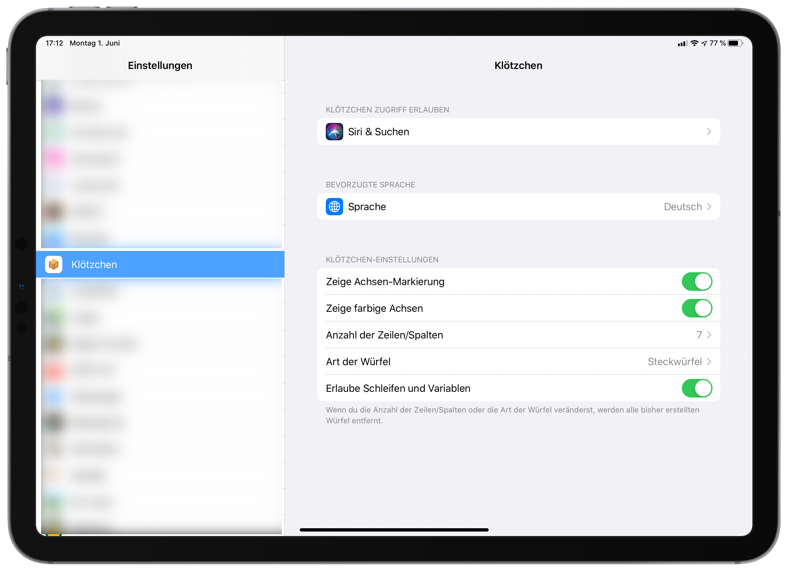

---
output:
  pdf_document: default
  html_document: default
---

# Bedienung der Klötzchen-App {#Bedienung}

## Grundhandlungen mit Würfeln

Wenn du die App startest, siehst du einen zweigeteilten Bildschirm, links eine **3D-Ansicht** und rechts den **Bauplan**. 

{width=75%}

Die App beinhaltet zwei Grundhandlungen:

* **Würfel hinzufügen**  
Um einen Würfel hinzuzufügen, **tippst** du einfach **auf eines der grauen Felder**. Natürlich kannst du auch auf einen Würfel noch einen Würfel setzen und noch einen usw. -- dazu musst du einfach immer wieder **auf den jeweiligen Würfel tippen.**

* **Würfel entfernen**  
Einen Würfel entfernst du, indem du **länger auf ihn drauf drückst.**

Diese Erklärung findest du auch noch einmal in der App, wenn du auf das **i** unten links tippst. 
Das Erstellen und Entfernen von Würfel funktioniert sowohl in der 3D-Ansicht als auch im Bauplan^[Im Bauplan lassen sich wegen der Eindeutigkeit der Darstellung nur Würfel hinzufügen oder entfernen, wenn man Holzwürfel eingestellt hat.]. Wenn du **in der einen Ansicht** etwas veränderst, geschieht dies sofort und **automatisch auch in der anderen Ansicht**.

Über den **Mülleimer-Button** unten in der Mitte kannst du das komplette Würfelbauwerk **löschen**.

> **Didaktischer Kommentar**    
> Die Handlungen *Würfel hinzufügen* und *Würfel entfernen* gibt es natürlich auch, wenn man mit echten Würfeln agiert. In der App jedoch gibt es hierfür relativ starke Einschränkungen: Man nimmt nicht erst einen Würfel auf, man muss ihn nicht exakt anhand des Schachbrettmusters ausrichten, man muss ihn nicht loslassen -- das einzige, was man tut, ist das Feld anzutippen. Damit verliert man einerseits vielfältige reale, haptische Erfahrungen (was schon einmal zeigt, dass man nicht auf echte Würfel verzichten sollte). Andererseits haben so auch Schülerinnen und Schüler mit motorischen Einschränkungen die Möglichkeit, mithilfe von Würfelbauwerken komplexere Aufgaben zu lösen, wozu sie mit echtem Material evtl. nicht in der Lage wären.

## Globale Einstellungen {#globaleEinstellungen}

In der zentralen Einstellungs-App^[Die ist die App mit dem grauen Zahnrad-Symbol. Öffne diese und scrolle  dann so lange nach unten, bis du die Klötzchen-App findest. Wenn du die Klötzchen-App auf dem Mac verwendest, kannst du die Einstellungen in der Menüleiste über Klötzchen → Einstellungen öffnen.] kannst du Eigenschaften der App anpassen.

{width=75%}

* Du kannst entscheiden, ob die farbigen **Koordinatenachsen** dargestellt werden sollen und ob diese mit **Ziffern beschriftet** werden.

* Außerdem kannst du die **Größe des Feldes** ändern -- zwischen 3x3 und 10x10.

* Weiterhin besteht die Auswahl zwischen Holzwürfeln, Steckwürfeln und Magischen Würfeln. Außer, dass die Würfel ein wenig unterschiedlich aussehen, besteht auch im Bauverhalten ein Unterschied: 
  * **Holzwürfel** lassen sich nur übereinander bauen, d.h. ein Würfel muss immer über einem anderen Würfel oder einem Schachbrett-Feld liegen. 
  * **Steckwürfel** dagegen lassen sich auch seitlich anbauen. Auch beim Entfernen von Würfeln spielt dies eine Rolle: Holzwürfel lassen sich nur von oben nach unten abbauen, Steckwürfel beliebig, solange keine Würfel in der Luft schweben würden.
  * **Magische Würfel** können Schweben. Der Aufbau erfolgt wie bei den Holzwürfeln, entfernen kann man Magische Würfel aber beliebig, so dass dann auch schwebende Würfel übrig bleiben können. 

* Außerdem kannst du entscheiden, ob in der Code-Ansicht **Schleifen** und **Variablen** möglich sind. Mehr dazu findest du im Abschnitt \@ref(bedienungCode).

## Ansichten ergänzen und wechseln

### Würfelgebäude drehen und zoomen

Die 3D-Ansicht kann mit einem Finger gedreht werden und mit zwei Fingern gezoomt werden. So hat man quasi die Möglichkeit, um das Würfelgebäude herum zu gehen. Auch ist es möglich, den Bau von unten zu betrachten.

### Schattenwände {#Schatteneinstellung}

Mit einem Tipp auf die drei Pünktchen unten links hast du die Möglichkeit, **Schattenwände** aufzubauen und die **Sichtbarkeit der Würfel** zu reduzieren. <!--Für diese Funktionen findest du in Kapitel \@ref(Schattenkapitel) einige Unterrichtsanregungen.-->

{width=75%}

### Weitere Ansichten

Über die Umschalter am unteren Rand kannst du nun in weitere Ansichten wechseln. Links sind dies die schon bekannte 3D-Ansicht und der Bauplan und auf der rechten Seite hast du neben dem Bauplan die Wahl zwischen dem **Zwei-/Dreitafelbild**, der **Schrägbilddarstellung in Kavalierperspektive**, der **isometrischen Schrägbilddarstellung** sowie (bei Holzwürfeln) einer **Code-Ansicht**. Auch hier gilt wieder: Wenn du links etwas änderst, wirkt sich das sofort auf die Darstellungen der rechten Seite aus.

Innerhalb des Zwei-/Dreitafelbildes und der Schrägbilddarstellung können allerdings nicht selbst Würfel hinzugefügt werden -- dies geht nur in der 3D-Ansicht und (bei Holzwürfeln) im Bauplan sowie der Code-Ansicht.

Über die grünen Umschalter am unteren linken und rechten Rand ist es weiterhin möglich, die linke bzw. rechte Ansicht vollständig auszublenden.

> Das Ausblenden einer Ansicht bietet sich z. B. an, wenn du einen Bauplan vorgibst, deine Schülerinnen und Schüler mit echten Würfeln das Gebäude erstellen sollen und dann die App nutzen können, um ihr Bauwerk zu überprüfen.

#### Zwei-/Dreitafelbild

Wenn du das Zwei-/Dreitafelbild auswählst, erscheint in beiden Ansichten eine rote Leiste, die an der einen Seite einen kleinen Würfel und an der anderen Seite eine kleine Kugel enthält. Diese Leiste dient der Orientierung, wenn die 3D-Ansicht mal wild gedreht werden sollte. Dies ist besonders dann hilfreich, wenn du in den [globalen Einstellungen](#globaleEinstellungen) die blaue und grüne Achse ausschalten solltest.

{width=75%}

Wenn du innerhalb des Zweitafelbildes mit zwei Fingern herauszoomst, ist noch eine dritte Tafel -- die Seitenansicht -- zu sehen. 

### Schrägbilder

Die beiden Schrägbilder stellen ebenfalls das Gebäude dar. In der Isometriedarstellung siehst du noch einen kleinen roten Stock zwischen den Feldern (2|2) und (3|3). Dieser kann ebenfalls behilflich sein beim Interpretieren der Bilder.

{width=75%}

### Code-Ansicht

***Diese Funktion steht nur bei Holzwürfeln und nicht auf dem iPhone zur Verfügung.***

Weiterhin gibt es eine Code-Ansicht, in der der Bauprozess dokumentiert wird. Hier sind noch einmal vielfältige Interaktionen möglich, auf die in Kapitel \@ref(bedienungCode) genauer eingegangen wird.

{width=75%}

## Export und Import

Über den **Ordner-Button** am unteren mittleren Rand ist es möglich, das Würfelbauerwerk bzw. einzelne Ansichten zu exportieren bzw. importeren.

{width=75%}

### Ansichten als Bilder exportieren

Wähle  hier aus, welche der sechs Ansichten exportiert werden sollen. Anschließend kannst du diese als **png-Dateien** speichern oder verschicken.

### Code als Text exportieren

***Diese Funktion steht nur bei Holzwürfeln und nicht auf dem iPhone zur Verfügung.***

Der Code, mit dem der Bauprozess des Würfelbauwerks dokumentiert wird, kann hiermit als **txt-Datei** gespeichert oder verschickt werden.

### Würfelgebäude speichern

Über diesen Button kann das komplette Würfelbauwerk inkl. aller Einstellungen, die vorgenommen worden sind, gespeichert oder verschickt werden.

Der Export erfolgt als **cubl-Datei**, ein eigenes Dateiformat für die Klötzchen-App.

> Wenn du auf diese Weise ein Würfelbauwek (z. B. per AirDrop oder E-Mail) an deine Schülerinnen und Schüler schickst, die die Klötzchen-App ebenfalls installiert haben, können diese sofort das Bauwerk auf ihren Geräten öffnen.

### Würfelgebäude öffnen

Ist auf dem Gerät eine **cubl-Datei** gespeichert, so kann diese mithilfe dieses Buttons geöffnet werden.

Es ist auch möglich, Dateien zu öffnen, die mit älteren Versionen der Klötzchen-App erstellt worden sind (bis Version 6.0, dies sind dann cubeling-Dateien), allerdings werden dann ggf. nicht alle Einstellungen übernommen.

## Bedienung der Code-Ansicht {#bedienungCode}

In der Code-Ansicht wird zunächst einmal protokolliert, welche Würfel in der 3D-Ansicht bzw. im Bauplan hinzugefügt bzw. entfernt werden.

{width=75%}

### Code-Zeile hinzufügen

Es ist nun weiterhin möglich, selbst Befehle hinzuzufügen. Hierzu müssen die entsprechenden **Buttons** im unteren Bereich der Code-Ansicht **angetippt** werden: 

* **`baueWürfel(bei: (Zahl,Zahl))`** baut einen Würfel bei den angegebenen Koordinaten.
* **`entferneWürfel(bei: (Zahl,Zahl))`** entfernt einen Würfel (sofern er existiert).

Sofern in den [globalen Einstellungen](#globaleEinstellungen) Schleifen erlaubt sind, ist weiterhin möglich:

* **`mache Anzahl mal {…}`** erzeugt eine Wiederholung, sodass der in der geschweiften Klammer stehende Befehl entsprechend oft ausgeführt wird.

Sind in den globalen Einstellungen auch Variablen erlaubt, gibt es weitere Befehle:

* Über **`Position = (Zahl,Zahl)`** erstellst du eine Variable, z. B. `PositionA`.
* Mit **`ändere(Position, um: (Zahl, Zahl))`** änderst du eine Variable um eine Richtung, z. B. `ändere(VariableA, um: (1,0))`.
* Über **`baueWürfel(bei: Position))`** und **`entferneWürfel(bei: Position)`** kannst du nun die Positionen verwenden, um dort Würfel zu bauen oder zu entfernen. 

Du kannst die Stelle, an der eine Code-Zeile eingefügt wird, über den grauen **Pfeil am linken Rand der Code-Ansicht** verändern.

{width=75%}

### Code-Zeile entfernen

Um eine Code-Zeile zu entfernen, musst du diese **nach links wischen**. Dann ist ein rot hinterlegter Papierkorb-Button zu sehen, über den du die Zeile löschen kannst.

{width=75%}

### Code-Zeilen verschieben

Über die **drei Striche** am rechten Rand der Code-Zeile kannst du die Reihenfolge der Zeilen verändern.

{width=75%}

> Es bietet sich an zu untersuchen, inwieweit eine geänderte Reihenfolge der Code-Zeilen das Würfelbauwerk beeinflusst. Solange ausschließlich `baueWürfel`-Befehle genutzt werden, ist dies natürlich noch nicht so interessant. Aber sobald Schleifen oder Variablen eine Rolle spiele oder der `entferneWürfel`-Befehl genutzt wird, kann dies zu interessanten Erkundungen führen.

Du kannst auch einzelne Code-Zeilen in bestehende Schleifen hineinziehen oder aus ihr herausziehen.

### Zahlen verändern ###

Es gibt zwei Möglichkeiten, die Zahlen, mit denen z. B. die Koordinaten beschrieben werden, im Code zu verändern. In beiden Fällen musst du zunächst in der Code-Zeile **auf die Zahl tippen**.

* Du kannst nun das **Nummern-Pad** nutzen, um die Zahlen, wie bei einer Tastatur, einzustellen. Über die **±-Taste** kannst du aus einer Zahl schnell ihre Gegenzahl machen.
* Du kannst die **Pfeiltasten** verwenden, mit denen du die Zahlen schrittweise größer oder kleiner machen kannst.

{width=75%}

### Ablaufverfolgung

Über des **Play-Button** unterhalb des Code-Fensters kannst du die Ablaufverfolgung starten. Nun wird der Code über **Antippen der Pfeiltasten** schrittweise ausgeführt.

> Auf diese Weise ist es möglich, die einzelnen Bauschritte nachzuvollziehen. Dies ist insbesondere bei Wiederholungsschleifen besonders interessant.

Wird eine **Schleife verfolgt**, so wird dargestellt, in welcher **Nummer der Schleife** man sich gerade befindet. Entsprechend wird am Ende der Schleife entschieden, ob diese wieder von vorn beginnt oder zur nächsten Code-Zeile gegangen wird.

Weiterhin ist es möglich, sich den **aktuellen Wert einer Position** anzeigen zu lassen. Dies ist dann von Relevanz, wenn sich der Wert innerhalb einer Schleife ändert und diese Veränderung nachvollzogen werden soll.

{width=75%}

