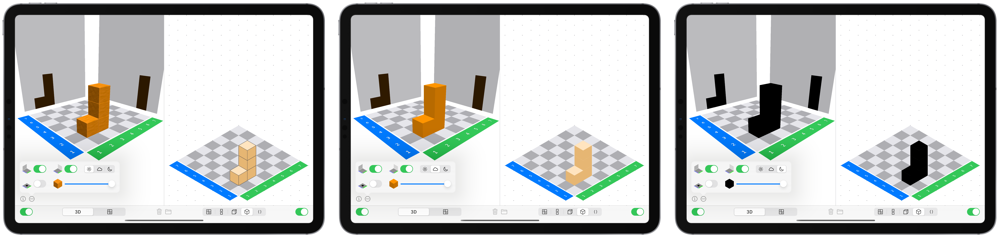

---
output:
  pdf_document: default
  html_document: default
---

# How to use the Cubeling app {#how-to-use}


## Basic actions with cubes

When you open the app, you will see a split screen, a **3D view** on the left and the **blueprint** on the right.
```{r echo=FALSE, fig.cap="App launch screen", fig.align='center', out.width='75%'}
knitr::include_graphics("pictures/app-start.png")
```

The app uses two basic actions:

* **Add cube**

  To add a cube, **tap** on one of the dark or light **gray squares**. You can, of course, also place a cube on top of another one, and another one, and so on -- simply **tap** on the respective cube again and again.

* **Remove cube**

  **Touch and hold a cube** to remove it.

This explanation can also be found in the app by tapping on the **i** at the bottom left.
You can add and remove cubes in both the 3D view and in the blueprint mode^[In the blueprint view, you can only add or remove cubes if you have selected wooden cubes, due to the uniqueness of the build(?) ]. When you change something **in one view**, the same change is immediately and **automatically adopted in the other view**.

The **trash can button** at the bottom center allows you to **delete** the entire connected cube structure.

> **Didactic note**    
> The actions **add cube** and **remove cube** of course also exist when working with real cubes. In the app, however, there are relatively strong constraints for this: You do not have to first pick up a cube, you do not have to align it perfectly according to the checkerboard pattern, you do not have to let it go -- the only thing you have to do is click on the space where you want it. On the one hand, you lose out on a range of real, haptic experiences (which goes to show that you should not forgo real cubes entirely). On the other hand, this gives students with motor impairments the opportunity to solve more complex tasks with the help of connected cube structures, which they might not be able to do with real objects. 


## Global settings {#global-settings}

In the main settings app on your device^[This is the app with the gray gear symbol. Open it and scroll down until you find the Cubeling app. If you are using the Cubeling app on a Mac, you can open the settings in the menu bar by clicking Cubeling → Preferences.] you can set your preferences for the app.

```{r echo=FALSE, fig.cap="App settings", fig.align='center', out.width='75%'}
knitr::include_graphics("pictures/settings-en.png")
```

* You can decide whether the colored **coordinate axes** should be displayed and if they should be labeled with **numbers**.

* You can also change the **size of the board** -- ranging between 3x3 and 10x10.

* Additionally, you can choose between wooden cubes, stackable cubes, and magic cubes. Apart from the slight visual differences between the cubes, there is also a difference in their building behavior.
  * **Wooden cubes** can only be stacked on top of each other, i.e. a cube always needs to lie either on top of another cube or directly on a checkerboard square.
  * **Stackable cubes**, on the other hand, can also be attached laterally. This also plays a role when removing cubes: Wooden cubes can only be removed from top to bottom, whereas stacking cubes can be removed freely, as long as no cubes would be floating mid-air.
  * **Magic cubes** can float. The construction is the same as with wooden cubes, but you can remove magic cubes freely, so that it is possible to have floating cubes remain. 

* You can also decide whether **loops** and **variables** are possible in the code view. You can find more on this in section \@ref(how-to-code).


## Modify and switch views

### Rotate and zoom into connected cube structure

Rotate the 3D view using one finger and zoom in or out with two. This practically gives you the ability to move around the cube structure (view the structure from all sides). It is also possible to view the structure from below.

### Shadow walls (?) and transparency {#Schatteneinstellung}

By clicking on the three dots at the bottom left, you can build **shadow walls** and increase the **transparency** of the cubes/reduce **visibility**.

```{r echo=FALSE, fig.cap="Configuring the shadow walls", fig.align='center', out.width='75%'}
knitr::include_graphics("pictures/app-shadow.png")
```


### Outline

Via the same three dots, you can also set your ability to see the outline of the built cube structure. You can choose between the regular cubes (sun), the disappearance of contours (cloud) or completely blacked out cubes (moon).

```{r echo=FALSE, fig.cap="Outline of connected cube structure", fig.align='center', out.width='100%'}

```


### Further views

You can use the toggle buttons at the bottom to switch between views. On the left, you have the, by now familiar, 3D view and the blueprint. On the right, in addition to the blueprint, you can choose between the **two/three-pane view**, the **oblique view in cavalier perspective**, the **isometric view**, and (for wooden cubes) a **code view**. Again, if you change something on one side, you will immediately see the change on the other as well.

However, cubes cannot be added when you are in the two/three-pane view or one of the slanted/perspective views -- this is only possible in the 3D view and (for wooden cubes) in the blueprint as well as the code view.

It is still possible to completely hide the left or right view via the green/blue? toggles at the lower left and right corners.

> Hiding a view can be useful if, for example, you provide a blueprint and have your students build the connected cube structure using real cubes. Then they can use the app to check their creations.

#### Two/three-pane view

If you choose the two/three-pane view, a red bar will appear in both panes with a small cube on one side and a small sphere on the other. This bar acts a way to orient yourself if the 3D view should ever be ferociously rotated. This is especially helpful if you have switched off the blue and green axes in the [global settings](#global-settings).

```{r echo=FALSE, fig.cap="Two-pane view", fig.align='center', out.width='75%'}
knitr::include_graphics("pictures/app-multiview.png")
```


If you are in the two-pane view and zoom out with two finger, a third pane -- the side view -- will appear.


### Schrägbilder/parallel projections?

Die beiden Schrägbilder stellen ebenfalls das Gebäude dar. In der Isometriedarstellung siehst du noch einen kleinen roten Stock zwischen den Feldern (2|2) und (3|3). Dieser kann ebenfalls behilflich sein beim Interpretieren der Bilder.

```{r echo=FALSE, fig.cap="Isometrische Darstellung", fig.align='center', out.width='75%'}
knitr::include_graphics("pictures/app-isometric.png")
```


### Code-view

***This function is only available when using wooden cubes and not on iPhones.***

There is also a code-view, which documents the building process of the cube structure. Here, once again, a variety of actions are possible, which will be discussed in more detail in chapter \@ref(how-to-code).

```{r echo=FALSE, fig.cap="Code-view", fig.align='center', out.width='75%'}
knitr::include_graphics("pictures/app-code-en.png")
```


## Export and import

If you click on the **folder button** in the middle of the lower edge, it is possible to export the entire connected cube structure or individual views as well open a previously saved cube building.

```{r echo=FALSE, fig.cap="Export and import", fig.align='center', out.width='75%'}
knitr::include_graphics("pictures/app-export-en.png")
```


### Export views as images

Select which of the six views you want to export. Then you can save or share them as **png-files**.

### Export code as text

***This function is only available when using wooden cubes and not on iPhones.***

The code documenting the building process of the cube structure can be saved or shared as a **txt-file**. 

### Save connected cube structure

This button can be used to save or share the entire cube structure, including all settings that were used during its build.

The exported file results in a **cubl file**, a custom file format for the Cubeling app.

> If you share a cube structure (via AirDrop or email, for example) with your students who also have the Cubeling app, they can immediately open the cube structure on their devices.


### Open connected cube structure

If a **cubl file** is saved on the device, you can use this button to open it.

It is also possible to open files that were created with older version of the Cubeling app (up to version 6.0, these are then cubeling-files), but it might be that not all settings are transferred.


## How to work with the code view {#how-to-code}


In the code view, the first thing that is recorded is which cubes are added or removed in either the 3D view or blueprint.

```{r echo=FALSE, fig.cap="Cubeling's programming", fig.align='center', out.width='75%'}

```


### Add a line of code

It is possible to add commands yourself. For this, the corresponding **buttons** at the bottom of the code view need to be **selected**:

* **`buildCube(at: (number,number))`** inserts a cube at the specified coordinates.
* **`removeCube(at: (number,number))`** removes a cube (should it exist).

Provided that loops are allowed in the [global setting](#global-settings), the following are also possible:

* **`do counting number times {…}`** creates a repetition so that the command in the curly brackets is executed the specified number of times. 

If variables are also allowed in the global settings, further commands exist:

* **`position = (number,number)`** creates a variable, for example `positionA`.
* Change a variable by one direction with **`change(position, by: (number,number))`**, for example `change(positionA, by: (1,0))`.
* With **`buildCube(at: position))`** and **`removeCube(at: position)`** you can now use the positions to build or remove cubes there.

You can change where a line of code is inserted via the gray **arrow on the left edge of the code view**.

```{r echo=FALSE, fig.cap="Change build location", fig.align='center', out.width='75%'}
knitr::include_graphics("pictures/code-arrow-en.png")
```


### Remove a line of code

To remove a line of code, **swipe it left**. A trash can with red backdrop will appear, which you can use to delete the line.

```{r echo=FALSE, fig.cap="Delete line of code", fig.align='center', out.width='75%'}
knitr::include_graphics("pictures/code-delete-en.png")
```


### Move a line of code

Rearrange code elements via the **three lines** at the right edge of the code.


```{r echo=FALSE, fig.cap="Rearrange line of code", fig.align='center', out.width='75%'}

```


> At this point, it could be interesting to see how changing the order of lines of code changes the resulting connected cube structure. As long as only `buildCube` commands are used, this does not prove very exciting. But as soon as loops or variables are included, or the `removeCube` command is used, this can lead to interesting explorations/results.

You can also drag individual lines of code into or out of existing loops. 

### Changing numbers ###

There are two ways to change the numbers, like those used to describe the coordinates, in your code. In both cases you first have to **tap on the number** in the code.

* You can now use the **number pad** to set the numbers, just like on a computer keyboard. The **±-key** allows you to quickly turn a number into its opposite number.
* You can use the **arrow keys** to increase or decrease the numbers step by step.


```{r echo=FALSE, fig.cap="Change numbers", fig.align='center', out.width='75%'}
knitr::include_graphics("pictures/code-number-en.png")
```


### Code Tracing

Clicking on the **play button** below the code starts the code tracing. **Using the arrows**, the code can now be executed one step at a time.

> In this way, it is possible to retrace the individual building steps. This is particularly interesting if loops were used.

If a **loop is played/traced**, the **number of the current pass** is displayed. Accordingly, at the end of the loop, it is decided whether it starts again or if it continues to the next line of code.

Moreover, it is possible to have the **current value of a position** displayed. This is relevant if the value of a position changes within a loop and this change is to be understood.


```{r echo=FALSE, fig.cap="Code tracing", fig.align='center', out.width='75%'}

```


