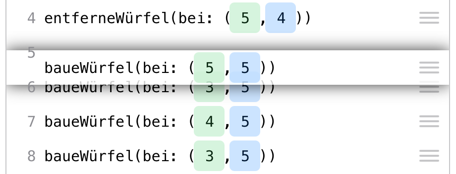
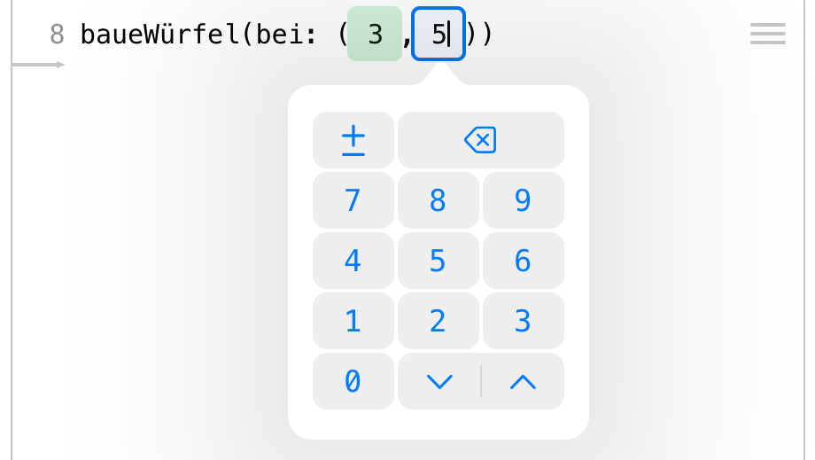
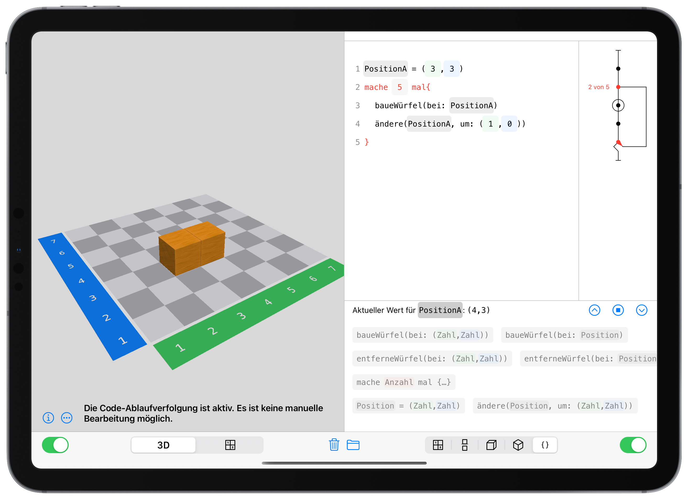

---
output:
  pdf_document: default
  html_document: default
---

# How to use the Cubeling app {#Bedienung}


## Grundhandlungen mit Würfeln/ Basic actions with cubes

When you open the app, you will see a split screen, a **3D view** on the left and the **blueprint** on the right.
```{r echo=FALSE, fig.cap="App launch screen", fig.align='center', out.width='75%'}

```

Die App beinhaltet zwei Grundhandlungen:
The app includes two basic actions:

* **Add cube**
To add a cube, **tap** on one of the **gray spaces/fields**. You can, of course, also place a cube on top of another one, and another one, and so on -- simply **tap** on the respective cube again and again.

* **Remove cube**
**Touch and hold a cube** to remove it.

Diese Erklärung findest du auch noch einmal in der App, wenn du auf das **i** unten links tippst. 
Das Erstellen und Entfernen von Würfel funktioniert sowohl in der 3D-Ansicht als auch im Bauplan^[Im Bauplan lassen sich wegen der Eindeutigkeit der Darstellung nur Würfel hinzufügen oder entfernen, wenn man Holzwürfel eingestellt hat.]. Wenn du **in der einen Ansicht** etwas veränderst, geschieht dies sofort und **automatisch auch in der anderen Ansicht**.

This explanation can also be found in the app by tapping on the **i** at the bottom left.
Adding and removing cubes works both in the 3D view as well as in the blueprint mode^[In the blueprint view, you can only add or remove cubes if you have selected wooden cubes, due to the uniqueness of the build(?) ]. When you change something **in one view**, the same thing happens immediately and **automatically in the other view**.

Über den **Mülleimer-Button** unten in der Mitte kannst du das komplette Würfelbauwerk **löschen**.
The **trash can button** at the bottom center allows you to **delete** the entire connected cube structure.

> **Didactic note**    
> The actions **add cube** and **remove cube** of course also exist when working with real cubes. In the app, however, there are relatively strong constraints for this: You do not have to first pick up a cube, you do not have to align it perfectly according to the checkerboard pattern, you do not have to let it go -- the only thing you have to do is click on the space where you want it. On the one hand, you lose out on a range of real, haptic experiences (which goes to show that you should not forgo real cubes entirely). On the other hand, this gives students with motor impairments the opportunity to solve more complex tasks with the help of connected cube structures, which they might not be able to do with real objects. 


## Global settings {#globaleEinstellungen}

In the main settings app on your device^[This is the app with the gray gear symbol. Open it and scroll down until you find the Cubeling app. If you are using the Cubeling app on a Mac, you can open the settings in the menu bar by clicking Cubeling → Preferences.] you can set your preferences for the app.

```{r echo=FALSE, fig.cap="App settings", fig.align='center', out.width='75%'}
knitr::include_graphics("pictures/settings.png")
```

* You can decide whether the colored **coordinate axes** should be displayed and if they should be labeled with **digits/numbers**.

* You can also change the **size of the board/field** -- ranging between 3x3 and 10x10.

* Additionally, you can choose between wooden cubes, linking cubes, and magic cubes. Apart from the slight visual differences between the cubes, there is also a difference in their building behavior.
  * **Wooden cubes** can only be stacked on top of each other, i.e. a cube always needs to lie either on top of another cube or directly on a checkerboard square.
  * **Linking cubes**, on the other hand, can also be attached laterally. This also plays a role when removing cubes: Wooden cubes can only be removed from top to bottom, whereas linking cubes can be removed freely, as long as no cubes would be floating mid-air.
  * **Magic cubes** can float. The construction is the same as with wooden cubes, but you can remove magic cubes freely, so that it is possible to have floating cubes remain. 

* You can also decide whether **loops** and **variables** are possible in the code view. You can find more on this in section \@ref(bedienungCode).


## Ansichten ergänzen und wechseln

### Würfelgebäude drehen und zoomen

Die 3D-Ansicht kann mit einem Finger gedreht werden und mit zwei Fingern gezoomt werden. So hat man quasi die Möglichkeit, um das Würfelgebäude herum zu gehen. Auch ist es möglich, den Bau von unten zu betrachten.

### Schattenwände und Sichtbarkeit {#Schatteneinstellung}

Mit einem Tipp auf die drei Pünktchen unten links hast du die Möglichkeit, **Schattenwände** aufzubauen und die **Sichtbarkeit der Würfel** zu reduzieren. 

```{r echo=FALSE, fig.cap="Einstellen der Schattenwände", fig.align='center', out.width='75%'}
knitr::include_graphics("pictures/app-shadow.png")
```


### Umriss

Weiterhin kann über die drei Punkte eingestellt werden, dass nur der Umriss des gebauten Körpers zu sehen sein soll. Es besteht die Wahl zwischen den normalen Würfeln (Sonne), dem Verschwinden der Konturen (Wolke) oder vollkommen schwarzen Würfeln (Mond).

```{r echo=FALSE, fig.cap="Umriss der Würfelbauwerke", fig.align='center', out.width='100%'}
knitr::include_graphics("pictures/app-outline.png")
```


### Weitere Ansichten

Über die Umschalter am unteren Rand kannst du nun in weitere Ansichten wechseln. Links sind dies die schon bekannte 3D-Ansicht und der Bauplan und auf der rechten Seite hast du neben dem Bauplan die Wahl zwischen dem **Zwei-/Dreitafelbild**, der **Schrägbilddarstellung in Kavalierperspektive**, der **isometrischen Schrägbilddarstellung** sowie (bei Holzwürfeln) einer **Code-Ansicht**. Auch hier gilt wieder: Wenn du links etwas änderst, wirkt sich das sofort auf die Darstellungen der rechten Seite aus.

Innerhalb des Zwei-/Dreitafelbildes und der Schrägbilddarstellung können allerdings nicht selbst Würfel hinzugefügt werden -- dies geht nur in der 3D-Ansicht und (bei Holzwürfeln) im Bauplan sowie der Code-Ansicht.

Über die grünen Umschalter am unteren linken und rechten Rand ist es weiterhin möglich, die linke bzw. rechte Ansicht vollständig auszublenden.

> Das Ausblenden einer Ansicht bietet sich z. B. an, wenn du einen Bauplan vorgibst, deine Schülerinnen und Schüler mit echten Würfeln das Gebäude erstellen sollen und dann die App nutzen können, um ihr Bauwerk zu überprüfen.

#### Zwei-/Dreitafelbild

Wenn du das Zwei-/Dreitafelbild auswählst, erscheint in beiden Ansichten eine rote Leiste, die an der einen Seite einen kleinen Würfel und an der anderen Seite eine kleine Kugel enthält. Diese Leiste dient der Orientierung, wenn die 3D-Ansicht mal wild gedreht werden sollte. Dies ist besonders dann hilfreich, wenn du in den [globalen Einstellungen](#globaleEinstellungen) die blaue und grüne Achse ausschalten solltest.

```{r echo=FALSE, fig.cap="Zweitafelbild", fig.align='center', out.width='75%'}
knitr::include_graphics("pictures/app-multiview.png")
```


Wenn du innerhalb des Zweitafelbildes mit zwei Fingern herauszoomst, ist noch eine dritte Tafel -- die Seitenansicht -- zu sehen. 


### Schrägbilder

Die beiden Schrägbilder stellen ebenfalls das Gebäude dar. In der Isometriedarstellung siehst du noch einen kleinen roten Stock zwischen den Feldern (2|2) und (3|3). Dieser kann ebenfalls behilflich sein beim Interpretieren der Bilder.

```{r echo=FALSE, fig.cap="Isometrische Darstellung", fig.align='center', out.width='75%'}
knitr::include_graphics("pictures/app-isometric.png")
```


### Code-Ansicht

***Diese Funktion steht nur bei Holzwürfeln und nicht auf dem iPhone zur Verfügung.***

Weiterhin gibt es eine Code-Ansicht, in der der Bauprozess dokumentiert wird. Hier sind noch einmal vielfältige Interaktionen möglich, auf die in Kapitel \@ref(bedienungCode) genauer eingegangen wird.

```{r echo=FALSE, fig.cap="Code-Ansicht", fig.align='center', out.width='75%'}
knitr::include_graphics("pictures/app-code.png")
```


## Export und Import

Über den **Ordner-Button** am unteren mittleren Rand ist es möglich, das Würfelbauerwerk bzw. einzelne Ansichten zu exportieren bzw. importeren.

```{r echo=FALSE, fig.cap="Export und Import", fig.align='center', out.width='75%'}
knitr::include_graphics("pictures/app-export.png")
```


### Ansichten als Bilder exportieren

Wähle  hier aus, welche der sechs Ansichten exportiert werden sollen. Anschließend kannst du diese als **png-Dateien** speichern oder verschicken.

### Code als Text exportieren

***Diese Funktion steht nur bei Holzwürfeln und nicht auf dem iPhone zur Verfügung.***

Der Code, mit dem der Bauprozess des Würfelbauwerks dokumentiert wird, kann hiermit als **txt-Datei** gespeichert oder verschickt werden.

### Würfelgebäude speichern

Über diesen Button kann das komplette Würfelbauwerk inkl. aller Einstellungen, die vorgenommen worden sind, gespeichert oder verschickt werden.

Der Export erfolgt als **cubl-Datei**, ein eigenes Dateiformat für die Klötzchen-App.

> Wenn du auf diese Weise ein Würfelbauwek (z. B. per AirDrop oder E-Mail) an deine Schülerinnen und Schüler schickst, die die Klötzchen-App ebenfalls installiert haben, können diese sofort das Bauwerk auf ihren Geräten öffnen.


### Würfelgebäude öffnen

Ist auf dem Gerät eine **cubl-Datei** gespeichert, so kann diese mithilfe dieses Buttons geöffnet werden.

Es ist auch möglich, Dateien zu öffnen, die mit älteren Versionen der Klötzchen-App erstellt worden sind (bis Version 6.0, dies sind dann cubeling-Dateien), allerdings werden dann ggf. nicht alle Einstellungen übernommen.


## Bedienung der Code-Ansicht {#bedienungCode}


In der Code-Ansicht wird zunächst einmal protokolliert, welche Würfel in der 3D-Ansicht bzw. im Bauplan hinzugefügt bzw. entfernt werden.

```{r echo=FALSE, fig.cap="Klötzchen-Programmierung", fig.align='center', out.width='75%'}
knitr::include_graphics("pictures/code-1.png")
```


### Code-Zeile hinzufügen

Es ist nun weiterhin möglich, selbst Befehle hinzuzufügen. Hierzu müssen die entsprechenden **Buttons** im unteren Bereich der Code-Ansicht **angetippt** werden: 

* **`baueWürfel(bei: (Zahl,Zahl))`** baut einen Würfel bei den angegebenen Koordinaten.
* **`entferneWürfel(bei: (Zahl,Zahl))`** entfernt einen Würfel (sofern er existiert).

Sofern in den [globalen Einstellungen](#globaleEinstellungen) Schleifen erlaubt sind, ist weiterhin möglich:

* **`mache Anzahl mal {…}`** erzeugt eine Wiederholung, sodass der in der geschweiften Klammer stehende Befehl entsprechend oft ausgeführt wird.

Sind in den globalen Einstellungen auch Variablen erlaubt, gibt es weitere Befehle:

* Über **`Position = (Zahl,Zahl)`** erstellst du eine Variable, z. B. `PositionA`.
* Mit **`ändere(Position, um: (Zahl, Zahl))`** änderst du eine Variable um eine Richtung, z. B. `ändere(VariableA, um: (1,0))`.
* Über **`baueWürfel(bei: Position))`** und **`entferneWürfel(bei: Position)`** kannst du nun die Positionen verwenden, um dort Würfel zu bauen oder zu entfernen. 

Du kannst die Stelle, an der eine Code-Zeile eingefügt wird, über den grauen **Pfeil am linken Rand der Code-Ansicht** verändern.

```{r echo=FALSE, fig.cap="Stelle zum Einfügen verändern", fig.align='center', out.width='75%'}
knitr::include_graphics("pictures/code-arrow.png")
```


### Code-Zeile entfernen

Um eine Code-Zeile zu entfernen, musst du diese **nach links wischen**. Dann ist ein rot hinterlegter Papierkorb-Button zu sehen, über den du die Zeile löschen kannst.

```{r echo=FALSE, fig.cap="Code-Zeile löschen", fig.align='center', out.width='75%'}

```


### Code-Zeilen verschieben

Über die **drei Striche** am rechten Rand der Code-Zeile kannst du die Reihenfolge der Zeilen verändern.


```{r echo=FALSE, fig.cap="Code-Zeile verschieben", fig.align='center', out.width='75%'}

```


> Es bietet sich an zu untersuchen, inwieweit eine geänderte Reihenfolge der Code-Zeilen das Würfelbauwerk beeinflusst. Solange ausschließlich `baueWürfel`-Befehle genutzt werden, ist dies natürlich noch nicht so interessant. Aber sobald Schleifen oder Variablen eine Rolle spiele oder der `entferneWürfel`-Befehl genutzt wird, kann dies zu interessanten Erkundungen führen.

Du kannst auch einzelne Code-Zeilen in bestehende Schleifen hineinziehen oder aus ihr herausziehen.

### Zahlen verändern ###

Es gibt zwei Möglichkeiten, die Zahlen, mit denen z. B. die Koordinaten beschrieben werden, im Code zu verändern. In beiden Fällen musst du zunächst in der Code-Zeile **auf die Zahl tippen**.

* Du kannst nun das **Nummern-Pad** nutzen, um die Zahlen, wie bei einer Tastatur, einzustellen. Über die **±-Taste** kannst du aus einer Zahl schnell ihre Gegenzahl machen.
* Du kannst die **Pfeiltasten** verwenden, mit denen du die Zahlen schrittweise größer oder kleiner machen kannst.


```{r echo=FALSE, fig.cap="Zahlen verändern", fig.align='center', out.width='75%'}

```


### Ablaufverfolgung

Über des **Play-Button** unterhalb des Code-Fensters kannst du die Ablaufverfolgung starten. Nun wird der Code über **Antippen der Pfeiltasten** schrittweise ausgeführt.

> Auf diese Weise ist es möglich, die einzelnen Bauschritte nachzuvollziehen. Dies ist insbesondere bei Wiederholungsschleifen besonders interessant.

Wird eine **Schleife verfolgt**, so wird dargestellt, in welcher **Nummer der Schleife** man sich gerade befindet. Entsprechend wird am Ende der Schleife entschieden, ob diese wieder von vorn beginnt oder zur nächsten Code-Zeile gegangen wird.

Weiterhin ist es möglich, sich den **aktuellen Wert einer Position** anzeigen zu lassen. Dies ist dann von Relevanz, wenn sich der Wert innerhalb einer Schleife ändert und diese Veränderung nachvollzogen werden soll.


```{r echo=FALSE, fig.cap="Ablaufverfolgung", fig.align='center', out.width='75%'}

```


