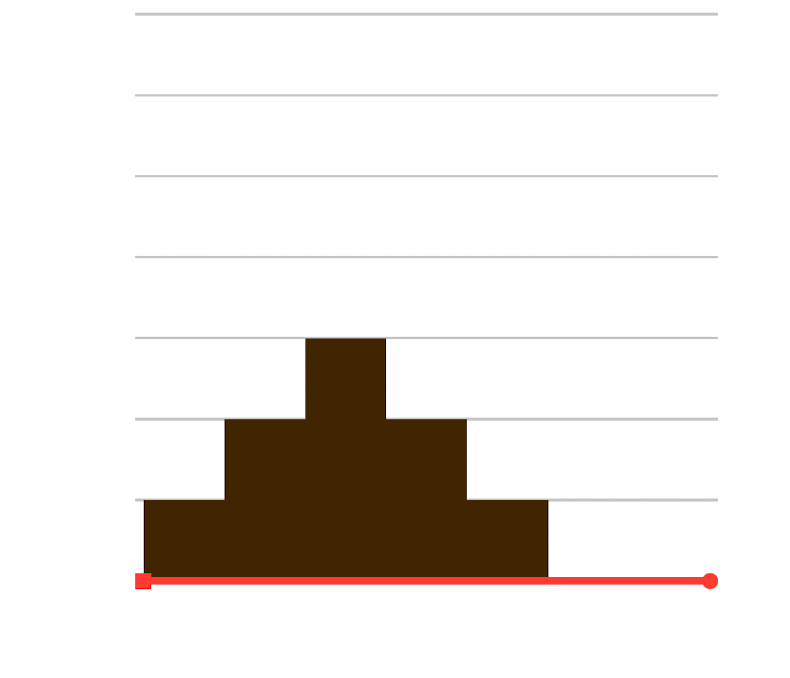
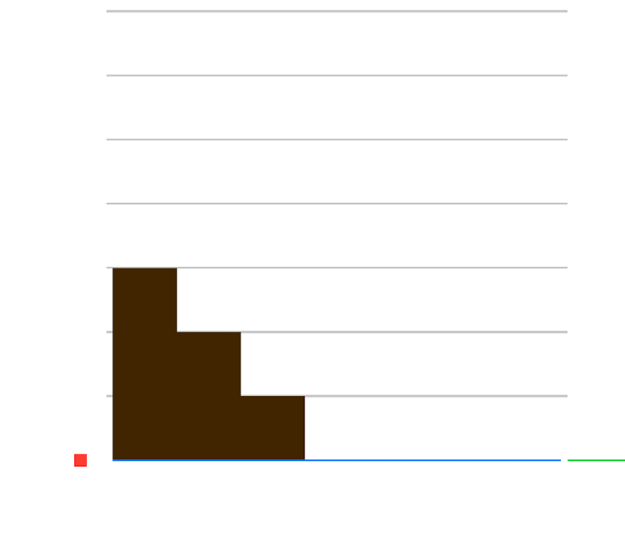
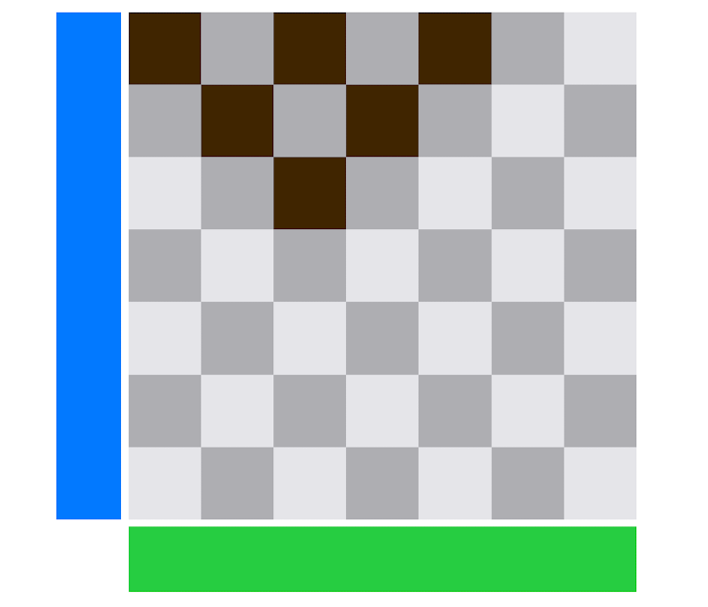
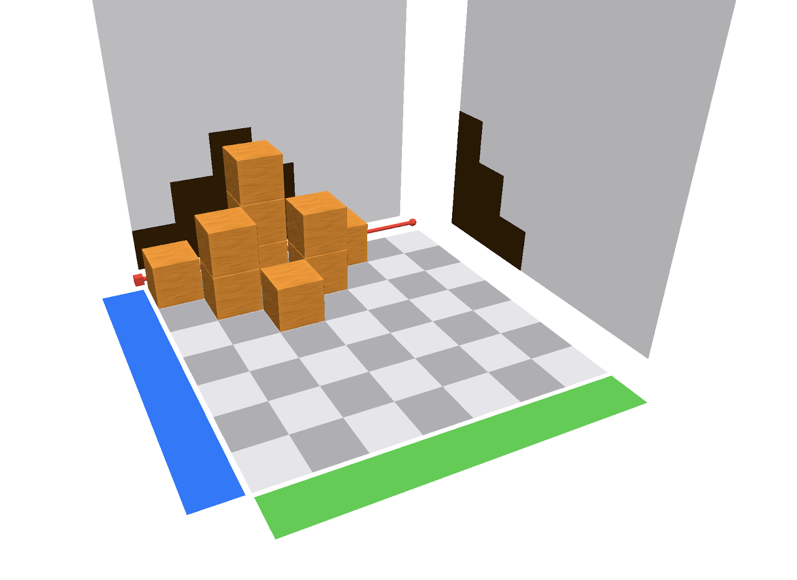
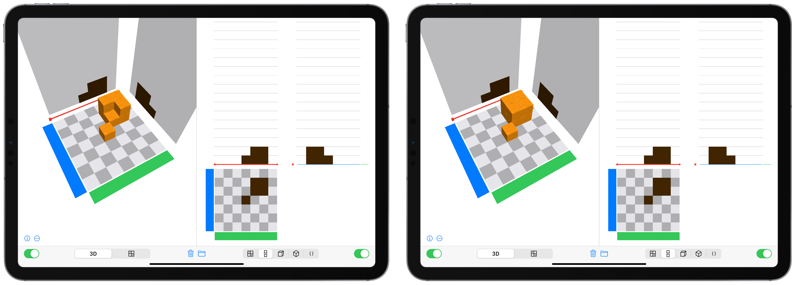

# Mit Klötzchen bauen {#Raumvorstellung}

In diesem Kapitel findest du Anregungen, wie du die Klötzchen-App nutzen kannst, um den **Übersetzungsprozess zwischen Würfelbauwerken und Schattenbildern** zu fördern. Dafür sollten die Schülerinnen und Schüler bereits mit realem Würfelmaterial gearbeitet haben sie sollten die Begriffe Vorderansicht, Seitenansicht, Draufsicht oder Aufriss, Seitenriss und Grundriss kennen.

Das Kapitel besteht aus drei Abschnitten mit verschiedenen Aufgabenstellungen im Zusammenhang mit der Klötzchen-App sowie hinweisen zu erwarteten Handlungen bzw. möglichen Schwierigkeiten.

Empfohlene App-Einstellungen: 

> Anzahl der Zeilen/Spalten: 7,  
> Holzwürfel,  
> farbige Achsen an,  
> Schattenwände eingeblendet

## Freies Bauen eines Bauwerks

```{block, type="task"}
*	Baut zu zweit mit zwölf Holzwürfeln ein Würfelbauwerk auf euer Feld. Das Bauwerk darf maximal drei Stockwerke hoch sein.
* Baut euer Würfelbauwerk in der Klötzchen-App nach.
* Tauscht euch miteinander aus: Beschreibt, was ihr an den Wänden in der App seht.
```

Für diese Aufgabe kann die [Kopievorlage des Schachbrettmusters](files/Cubeling-BuildingPlan-v2-de.pdf){target="_blank"} verwendet werden (siehe auch Material in [Kapitel 4](#Material)).


### Erwartete Handlungen {-}
Die Schülerinnen und Schüler erkennen, dass ihre Würfelbauten Schatten an die Wände werfen. Man könnte in diesem Zusammenhang die eventuellen Unterschiede der Schatten thematisieren und außerdem die Lichtquelle für die einzelnen Schatten lokalisieren.

### Mögliche Schwierigkeiten {-}
Einzelne Kinder könnten die Würfel versetzt und nicht aufeinander (nebeneinander) platzieren, wodurch ein Nachbau in der App nicht möglich ist. Einzelne Würfel könnten vom Tisch fallen.


## Bauwerk zu Schattenbildern

```{block, type="task"}
1. Baut ein Würfelbauwerk, sodass es zum gegebenen Aufriss passt. 
Vergleicht anschließend eure Bauwerke und beschreibt eure Beobachtungen.

<center>
{width=40%}
</center>

2. Verändert euer Würfelbauwerk so, dass es zum Aufriss aus Aufgabe 1 und zum gegebenen Seitenriss passt. 
Vergleicht eure Bauwerke und beschreibt, wie ihr vorgegangen seid. 
Wie viele Möglichkeiten gibt es insgesamt? Begründet dies!

<center>
{width=40%}
</center>

3. Verändert euer Würfelbauwerk erneut, sodass es nun auch noch zum gegebenen Grundriss passt. Achtet darauf, dass die Rissebenen aus 1. und 2. erhalten bleiben.
Vergleicht eure Bauwerke im Anschluss. Was fällt euch auf? 

<center>
{width=40%}
</center>
```

Es bietet sich an, nach jeder Aufgabe 1., 2. und 3. eine kurze Diskussion bzw. Ergebnissicherung im Plenum einzuleiten.

{width=50%}
Je nach Klassensituation kann statt von »Aufriss«, »Seitenriss« und »Grundriss« auch von »Vorderansicht«, »Seitenansicht« und »Draufsicht« gesprochen werden. 

Die Abbildung rechts zeigt die korrekte Lösung der Aufgabe.


### Erwartete Handlungen {-}
Die Kinder stellen fest: Je mehr Risse zu einem Würfelbau gegeben sind, desto weniger Würfelbauten lassen sich finden. Weiterhin finden sie verschiedene Möglichkeiten den Bau zu verändern und/oder zu erweitern, ohne dass die Schatten sich verändern. Sie begründen dies, indem sie mit eigenen Worten beschreiben, aus welcher Richtung das Licht kommt.

### Mögliche Schwierigkeiten {-}
Bei der Umsetzung von Aufgaben 1 und 2 kann es passieren, dass einige Kinder die genaue Position der Schatten nicht identifizieren können und folglich den Würfelbau irgendwo auf dem Feld platzieren.

Weiterhin kann es dazu kommen, dass bei Aufgabe 2 zwei Würfelbauten voneinander losgelöst auf dem Feld errichtet werden, sodass die zwei gesuchten Schatten in den jeweiligen Ebenen dargestellt werden, jedoch auch noch weitere Schatten in den Ebenen abgebildet werden.

Darüber hinaus kann es passieren, dass die Schülerinnen und Schüler den Würfelbau so konstruieren, dass die Schatten spiegelverkehrt in den Ebenen abgebildet werden.  


## Forschungsauftrag

```{block, type="task"}
Charlie behauptet:
*»Bei drei gegebenen Rissen kann es nur einen möglichen Würfelbau geben, weil jeder Würfel, den du hinzufügst oder entfernst, direkt an einem der drei Risse sichtbar wird.«*

Cem entgegnet:
*»Auch bei drei gegebenen Rissen sind mehrere Würfelbauten möglich. Nicht immer wird jeder Würfel auf einem der drei Risse sichtbar.«*

Erstelle verschiedene Würfelbauten und erkläre, wer von beiden Recht hat.
```

Eine mögliche Differenzierung bzw. Hilfestellung kann hier durch das Bereitstellen eines beispielhaften Würfelbauwerkes erfolgen, welches Cems Aussage stützt. Die Schülerinnen und Schüler erhalten dann die Aufgabe, darüber zu diskutieren und gegebenenfalls weitere Möglichkeiten zu finden.

<center>
{width=95%}
</center>


### Erwartete Handlungen {-}
Die Schülerinnen und Schüler diskutieren unterschiedliche Herangehensweisen und erkennen, dass es trotz gleicher Risse unterschiedliche Würfelbauten geben kann, dies jedoch nicht bei jedem Würfelbauwerk möglich ist. 


## Mögliche Anschlusshandlungen

Aufbauend auf die vorherigen Vorschläge bieten sich folgende Anschlusshandlungen an:

```{block, type="hint"}
*	zu vorgegebener Würfelanzahl das kleinst-/größtmögliche Würfelbauwerk bauen/finden  
*	Würfelbauwerke zu gegebenen Rissen bauen  
*	Ansichten und Baupläne auf Papier zeichnen und in der App bauen sowie dies mit den Zeichnungen kontrollieren  
*	Würfelbauwerke mit Schattenwänden erschaffen, Würfel anschließen transparent einstellen und die Schülerinnen und Schüler das gesuchte Bauwerk am eigenen Tablet bauen lassen
```

Weitere Anregungen zur Nutzung der Klötzchen-App im Zusammenhang mit der Schulung der Raumvorstellung findet man bei @Ladel:2017, @Bonig:2018, @Pilgrim:2018, @PIKASdigi:2020 oder @Rahn:2020.
