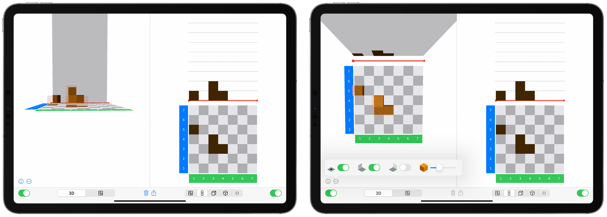
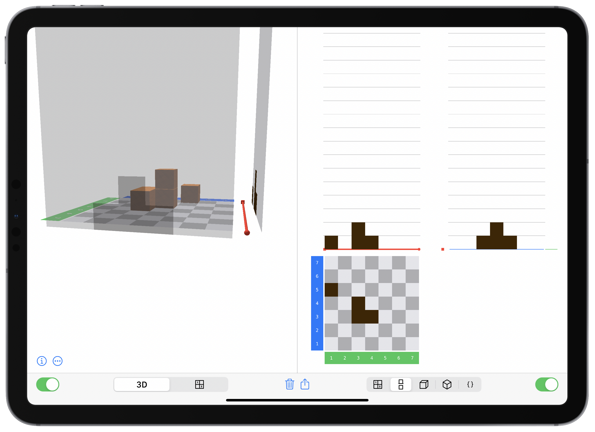

# Build with Cubeling {#Shadow}

***This chapter does not yet exist.*** 

Until then, you can find some inspiration for using the Cubeling app in connection with teaching spatial abilities (in German) at @Ladel:2017, @Bonig:2018, @Pilgrim:2018, @PIKASdigi:2020 or @Rahn:2020.

<!-- ## Erstkontakt zur App -->

<!-- ## Würfelgebäude beschreiben -->

<!-- ## Schattenbilder interpretieren {#Schattenkapitel} -->

<!-- ### Das Zweitafelbild transparent machen -->

<!-- Eine bedeutsame Handlung zur Schulung des räumlichen Vorstellungsvermögens ist das Arbeiten mit Schattenbildern. Häufig werden hierfür Würfelgebäude genutzt und untersucht, welche Schatten diese auf eine Wand werfen würden (oder auch tatsächlich werfen, wenn man eine Wand und Licht zur Verfügung hat). -->

<!-- 
 -->
<!-- {width=50%} -->
<!-- 
 -->

<!-- Auch in der Klötzchen-App können die virtuellen Würfel Schatten werfen, dies lässt sich in der App ganz einfach [einstellen](Schatteneinstellung). Dabei hilft die App auf besonders gute Weise, die Entstehung des Zweitafelbildes nachzuvollziehen. Legt man nämlich beide Ansichten nebeneinander und richtet die Felder entsprechend aus, kann man über den Schieberegler die Transparenz der Würfel erhöhen und so wird in der 3D-Ansicht der Schatten sichtbar, der im Zweitafelbild auf dieselbe Art und Weise dargestellt ist. -->

<!-- 
 -->
<!-- {width=100%} -->
<!-- 
 -->

<!-- Dies ist selbstverständlich auch mit dem Dreitafelbild möglich.  -->

<!-- 
 -->
<!-- {width=75%} -->
<!-- 
 -->

<!-- ### Durch Wände bauen -->

<!-- Eine weitere Besonderheit der Klötzchen-App ist die Möglichkeit, durch Wände zu bauen. So können Sie die Schattenwände auch von außen betrachten -- dann werden sie auf magische Weise halb durchsichtig. Und trotz, dass da eine Wand steht, können Sie durch sie hindurch Würfel bauen und entfernen und gleichzeitig beobachten, welche Auswirkungen dies auf den Schatten hat. -->

<!-- 
 -->
<!-- {width=75%} -->
<!-- 
 -->

<!-- ## Ansichten übersetzen -->

