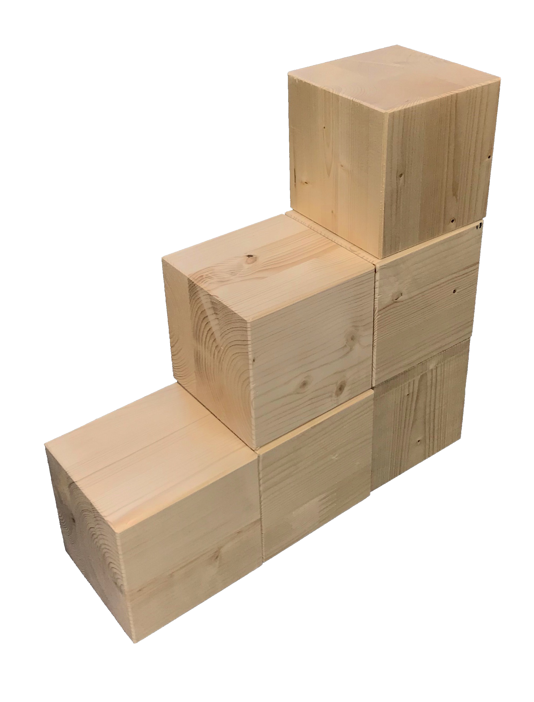
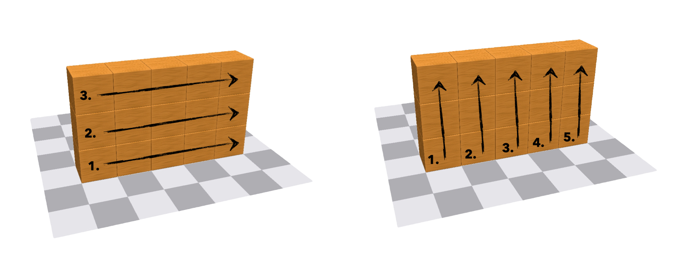
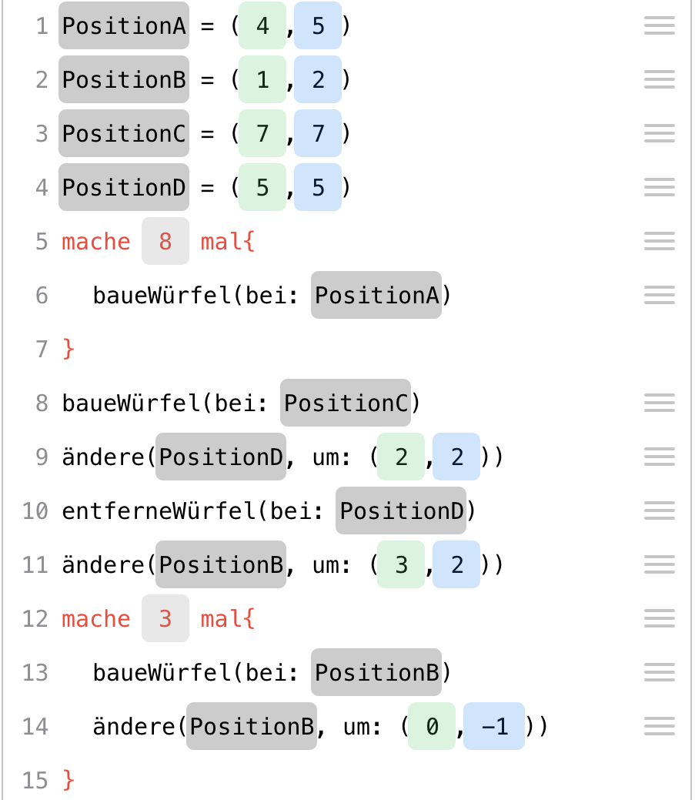
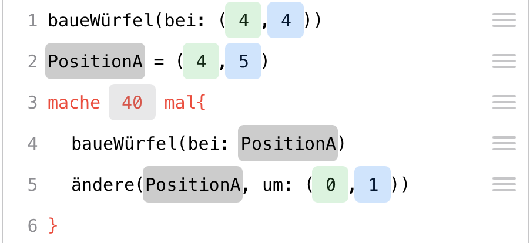
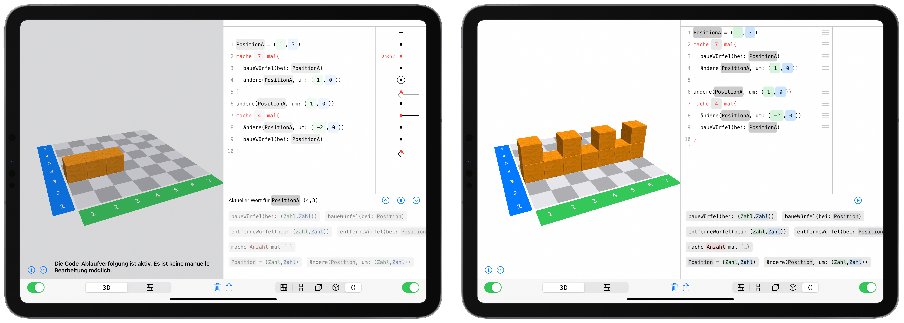

# Programming with Cubeling {#Coding}

The goal of this section is not to turn your students into programmers with the help of digital cubes. Rather, the aim is to develop a **feeling for an algorithmic perspective** on building connected cube structures and to focus on the **process of construction**. This process is documented, made *translatable* for a computer, and basic coding structures like loops are made visible to showcase the **potential of these structures**.

Cubeling's code view was developed in connection with a trial at a school in Brandenburg. Based on the experiences gained in that project week, this chapter presents a possible sequence of four teaching blocks that can be used to explore coding in the Cubeling app. Of course, a more spread out and gradual incorporation into math lessons is also possible.


## Classification and goals

Coding with Cubeling addresses skills in the fields of both mathematics and media informatics.

***Mathematics Educational Standards.*** With regard to the educational standards for primary school level [KMK, -@KMK:2005], the competency of **representation** is particularly encouraged: Students can create, select, and use appropriate representations for working on mathematical problems and can compare and evaluate representations with one another. At secondary school levels [KMK, -@KMK:2004], the concept also furthers the competencies **use of mathematical representations** (especially creating and using standard representations of mathematical objects and situations, interpreting or modifying given representations reasonably, evaluating different representations and forms of representation in a purpose-oriented way) and **dealing with symbolic, technical, and formal elements of mathematics** (here specifically, using mathematical aids and digital mathematical tools directly, applying formal mathematical procedures, and selecting and using digital mathematical tools efficiently depending on the situation and purpose).

This is all implemented in the app's concept with particularly the **guiding principle of space and shape** in mind.

The individual tasks most definitely also address numerous other general and content-related mathematical competencies, but the ones mentioned here represent the main goals of the concept.

***KMK: Education in the digital world.*** The concept also contributes to fulfilling some of the competencies that were issued by the Standing Conference of the Ministers of Education and Cultural Affairs conference in their strategy for "Education in the digital world" [KMK, -@KMK:2016]. Particularly noteworthy here are: **Recognizing and formulating algorithms** (5.5), **Knowing and understanding operating principles and basic principles of the digital world** (5.5.1), **Recognizing and formulating algorithmic structures in the digital tools used** (5.5.2), and **planning and using a structured, algorithmic sequence to solve a problem** (5.5.3).

***D-EDK: Media and Informatics.*** In the Curriculum 21 on the subject of "Media and Informatics" [D-EDK, -@D-EDK:2016] issued by the German-Swiss conference of Directors of Education, some more detailed goals for education in connection with digital media are stated, which are targeted when coding with the Cubeling app.  Particular emphasis in put on the following competencies (MI2.2): Students can **read and manually execute simple sequences with loops and parameters**; they understand that a **computer can only execute predefined instructions** and that a **program is a sequence of such instructions**; they can **write and test programs with loops and parameters**; they can **formulate their own algorithms in the form of functioning and correct computer programs with variables**; and they can **compare and evaluate different algorithms for solving the same problem**.

> Self-discovery is of particular importance here. The experiences gained in cube building tasks lead to the discovery of general methods, which can be tested for effectiveness and efficiency during coding and possibly improved. The fact that this has to be done in a playful and action-oriented way is realized by the building of cube structures and the connections drawn to experiences from math lessons.


## Introduction to processes of description

You will need:

> About 10 small wooden cubes per student;  
> Dice;   
> iPads with the Cubeling app installed;  
> [Worksheet](files/Cubeling-Worksheet-v2-de.pdf){target="_blank"} (tasks 1 to 4);  
> Possibly [presentation with tasks](files/Cubeling-Tasks-v2-de.pdf){target="_blank"}

Recommended app settings: 

> Number of rows/columns: 7;  
> Wooden cubes;   
> Show coordinate numbers and colored axes;  
> No loops or variables  


### Motivation and familiarization phase


Since we carried out this project in a class that was unfamiliar to us, we preceded the actual topic of the lesson with a familiarization phase. This phase, of course, also included mentions of cubes. If you already know the class, you can use similar tasks for motivation, perhaps also as homework, or you omit this phase altogether.


As a warm-up and a means to get to know each other, the students were given the following task: 
  
```{block, type="task"}
**Task**  
Toss a die and do all actions that are assigned to a number less than or equal to the one you rolled:  
**1** Make yourself a name tag!  
**2** Write an adjective in front of your name that begins with the same letter as your first name!  
**3** Draw a small picture on your name tag that has something to do with your favorite hobby!  
**4** Estimate how many cubes each of your classmates would have to take out of the box so that all children have the same number of cubes. Write this number on your name tag!  
**5** Think about what animal living in the forest you would most like to be and draw or write it on your name tag!  
**6** Try to recreate this animal using the cubes. 
```

A large box with wooden cubes was placed on the teacher's desk. We used wooden cubes of the size 2 x 2 x 2 cm.^[for example ones found on [www.holzwuerfel.com](http://www.holzwuerfel.com)]

The first pragmatic purpose was of course the creation of the name tags. In addition, this task also includes the deliberate estimation of quantities, and the last task even already touches on to the upcoming activities with the cubes. 

This phase already allows for various differentiation possibilities: Students who were able to finish their (few) tasks early can help others or complete further tasks voluntarily.

### Formulating the goal

After this activity, the goal of the project was explained, namely that cube structures are to be created with the help of computers. As a small preview of what creative realms this can lead to, the popular game "Minecraft" was referenced, to which students reacted enthusiastically. Concrete knowledge about the computer game on the part of the teacher is not necessary. It is merely a matter of motivating the students and finding ties to their own lives.

```{block, type="hint"}
**Lesson goal**  
We want to use computers to build connected cube structures. The computer helps us to build relatively complex structures in a quick way.
```

### Describing a cube
Since computers are not "thinking entities" per se, they always need to be told exactly what to do. This situation was playfully analogized by a fictitious encounter with an alien.

```{block, type="task"}
Imagine an alien standing in front of your door tomorrow morning. It has learned your language quickly due to its high intelligence, but its culture only has it knowing about round shapes. For your new board game, however, you need a cube/die?. Try to explain to the creature what a cube/die is.

Act out the situation with the person sitting next to you by pretending to be the alien! The alien here is completely unknowledgeable and should ask critical questions if it does not understand something. Afterwards, switch roles.
```

Especially the last point should be emphasized by the teacher, because the students in our session tended to take their previous knowledge as given and "probed" the other student less. But that is exactly the goal of the exercise! The point is to describe the shape of a cube as clearly and precisely as possible, so that everyone is able to unambiguously conceive this object. The alien serves as a representative object, for which it is necessary to describe with exactness.

Due to the openness of the task, there is no one correct solution. Therefore, in our case, the students tried to draw, build, or use terms like "corners", "sides", or "edges" to describe the shape. Depending on how much time you want to take for this task, you could discuss when a cube is mathematically unambiguously/well-defined or not. It is important to work out the different ways the descriptions were executed: verbally, through gestures, graphically, crafting, ... In each of these cases, it can be discussed that an unambiguous, unequivocal description is not so easy. The advantages and disadvantages of each mode of describing can also be discussed. Describing cubes, cube structures, or the building process itself will be a common thread throughout the entire lesson. The alien situation has demonstrated the necessity of describing and can now be referred back to in the further course of the lesson.

### Describing cube structures

The next step is now to describe a more complex shape: a connected cube structure. The students received the following task:

```{block, type="task"}
Put a privacy shield between you and the person sitting next to you. Think of a cube structure with 10 cubes and build it on your side. Explain to your partner how they can build this structure. Then compare your cube structures and switch roles.

What problems arose when describing the building process of the cube structure?
```

The goal of this task is the notion that it could be helpful to not only describe the finished structure, but also the process of how it was built. It also trains the development of a "command system": Students had to think very carefully about which actions to mention without being misunderstood. Similar to the previous task, a wide variety of solutions were presented. For example, students divided their structures into smaller "easier units", such as a row, a tower, or a 2x2x2 cube. They even gave interesting instructions like, "Make a 2x4 rectangle!". A further approach was to number the pieces and positions on the table - similar to a coordinate system or a checkerboard pattern. Most agreed, when discussing it as a class, that it makes the most sense to start with one cube and to then describe the next moves by using its spatial directions to specify on which side a certain number cubes should be placed. Instead of only "building" the structure, one group even described a larger, easier shape and then had cubes removed from it.

Many of these ideas and approaches are helpful to call on later when the students are "coding". For example, the breaking down into "smaller units" is an essential approach in informatics and is reflected in the coding in the Cubeling app (e.g. building a row using loops). The idea of numbering is particularly prominent in the app through the checkerboard pattern and the desire for concrete locations of the cubes. Positions and relocations can be used to specify exactly in what direction the cubes are to be built, and the idea of removing cubes from a larger shape will also be found in a similar form in a later exercise task. 

### Free/unhindered exploration of the app

Compared to the alien situation, it is now the iPad that should be viewed as an "alien": It needs to be told exactly how to build a specific cube structure. The children, in groups of two, were given 10 minutes (after a short explanation/demonstration how to handle the iPads) to experiment at will with the Cubeling app. The settings on all iPads were set to 7 rows/columns. Loops and variables were initially deactivated and the type of cube was set to "wooden cubes".

```{block, type="task"}
Imagine you are architects and want to describe a cube structure to a computer so that it can model it. Unambiguity and clarity are of particular importance here.

Find out everything the Cubeling app can do.
```

The unhindered experimenting trains children's quick comprehension skills and essentially allows everyone to adjust to and become familiar with a new (in this case virtual) environment at their own speed. To increase communication and so that not as many technical devices are needed, the children can work in pairs.

Afterwards, the most important functions of the app were collected in a class discussion. At this point it is not yet necessary to explain every minor detail. The most important questions that should be clarified in this round are the following:

```{block, type="hint"}
- Which different views are there, what are they called, and how do I switch from one to the other?
- How do I build or remove cubes in the 3D view and in the building plan?
- How do I build or remove cubes in the code view?
- How can I hide one side?
- How can I remove all cubes (and the lines of code) at once?
- What do the colors blue and green represent?
```

These questions are important in that they help the students get to know the most important functions and, as the project progresses, they can use the technical terms for the different views when communicating with each other.

The code view is thus another possibility (apart from those usually already known) to display cube structures. This view does not necessarily have a special meaning at this point, but is rather just one of many. What power it actually possesses will be explored as the project progresses.

### Exercises on building cube structures

This was followed by the first practice stage, which focused on a more in-depth engagement with the app.


```{block, type="task"}
Complete tasks 1 to 4 on the [worksheet](files/Cubeling-Worksheet-v2-de.pdf){target="_blank"}!
```

With the tasks 1 to 4, students can work through the individual views and functions of the app in a structured way. Some practical references (e.g., writing letters on a checkered pattern using cubes/blocks, like on the displays in the train) are also included and can be made the subject of discussion verbally. Task 3 ("Build the largest possible X!") already reveals a special feature: In the code view, it is theoretically possible to build beyond the 7x7 board and thus build an "infinitely" large X. This is, of course, not feasible in practice, and even a size of 100 squares in each direction is very tedious without a loop. This issue is again addressed in task 4 ("What happens when I build a cube outside the given range?"). The overall purpose of the tasks is to better understand the concept of the app's code view. Students should not only be able to use the app but also understand why some functionalities or graphical symbols are presented the way they are.


## Working with the code view

You will need:

> iPads with the Cubeling app installed,  
> [worksheet](files/Cubeling-Worksheet-v2-de.pdf){target="_blank"} (tasks 5 to 7)  
> possibly [presentation with tasks](files/Cubeling-Tasks-v2-de.pdf){target="_blank"}

Recommended app settings: 

> Number of rows/columns: 7;  
> Wooden cubes;  
> Show coordinate numbers and colored axes; 
> No loops or variables    


### Analysis of the code view

As soon as the first students had finished tasks 1 to 4, task 4 was discussed together on the (chalk/white)board. Tasks 1 to 3 are hard to compare and there was little need for discussion here. Smaller questions, especially geared towards the functionalities of the app, were mostly resolved during the individual work phase. 

The discussion of task 4 was focused on getting familiar with the code tracing. It will be needed in the subsequent tasks and for visualizing loops. 

{width=50%}
This stage also provides opportunity for making ties to working with negative numbers and describing locations in the plane with the help of a special coordinate system. We did not go into depth here, instead working rather intuitively with everything, which did not present any difficulties for the students. The changeable values for variables provided support: If you touch a coordinate in the code view, you can change it step by step using the green or blue arrows - also into the negative range. 

<!-- <center> -->
<!-- </center> -->
The decision to be able to build beyond the borders of the board in both the positive and negative direction was in part implemented to avoid error messages/codes?: At latest, problems would arise with larger loops. In principle, the app is designed in such a way that hardly any errors occur, and the questions in task 4 draw attention to those few that are possible. The key here is to encourage the children to ask questions like "What happens if...?". Incorrect or incomplete lines of code are not executed.


### Using the code view
After this the students worked on the tasks on the back of the worksheet. 

::: {.task}
Do tasks 5 to 7 on the [worksheet](files/Cubeling-Worksheet-v2-de.pdf){target="_blank"}!
::: 

Task 5 (reflection of cube structure in the code view) initially involves recognizing the mathematical structure for/of the reflection. The question about the transfer to an 8x8 or 9x9 board is supposed to motivate the generalization of the task and the underlying rules/regularity. We took this opportunity to show the class how to increase the size of the board up to 10x10 squares in the settings. During our run through, some students found the number pairs 1 and 7, 2 and 6, 3 and 5, ... and also intuitively recognized a pattern. But only after our hint, "What do the two numbers add up to?", were they able to formulate a rule. The observed connection was recorded on the white/chalk board as follows:

<center>
*green*<sub>old</sub> + *green*<sub>new</sub> = 8 therefore *green*<sub>new</sub> = 8 – *green*<sub>old</sub>
</center>

or in general, if *n* is the number of rows/columns:

<center>
*green*<sub>old</sub> + *green*<sub>new</sub> = *n* + 1 therefore *green*<sub>new</sub> = *n* + 1 – *green*<sub>old</sub>
</center>

Whether the variables *n*, *green*<sub>old</sub>, and *green*<sub>new</sub> should actually be used or not depends greatly on the class. However, due to the concrete association with the built cube structures, no difficulties presented themselves in our run-through/execution. Interestingly, this observed connection is independent of whether n is even or odd - though when n is even, no cubes can be on the axis of reflection, but when n is odd, they can.

In task 5 (step-by-step addition of lines of code to build three cube structures), cubes must be added and removed from structure 1 to structure 2 and structure 3, respectively. The goal is to gain a first insight into the fact that during the construction of a cube structure, several "partial structures" are already created as well. This progression is easy to follow in the code.


<center>
{width=75%}
</center>


We used task 7 as an additional task for students that finished ahead of everyone else. Here, the children generated their own structures. For further differentiation, you can ask about "particularly difficult" views. It can be addressed that some views are not unique and therefore one can easily confuse their partner (Gegner?). Supporting questions here are:

::: {.hint}
- Which views are unique? 
- Why can I not tap to build in all views? 
- Can I build two different buildings that have the same multiview orthographic projection, the same oblique view, or the same isometric view?
:::

The fact that not all views allow building by touch is precisely due to the uniqueness. Only the 3D view and - for wooden cubes - the building plan and code view are unique. This discussion provides a good transition from the content of math lessons (uniqueness of projections, descriptions) to the code view in the app and thus to coding and working with algorithms. Coding (or programming) is therefore "only" an additional form of representation and made easily accessible to the children via the example of cube structures.

### Distinction between process and product

The second half of the lesson deals with the distinction between "process" and "product". For this, we set up a relatively simple cube structure and the class received the following task:

::: {.task}
Build the cube structure in the code view! 
{width=20%}


Compare the structure you have created with that of your neighbor. The following questions can help you:

- Has the same structure been created?
- Does it look like the one on the table at the front?
- Is the structure positioned correctly?
- Can you find a difference in any of the different views?
- Is one structure constructed "better" than the other? What might "better" mean in this context?
:::

In most cases, the same structure as the one up front at the teacher's desk was built. However, due to a non-existent coordinate system, the structures were in different positions/locations. In addition, it is possible to add cubes in a different order and to correct mistakes (for example, incorrectly placed cubes), which can still be seen in the code view. Especially the code view should stand out here, because it is not only the only always unique view, but it also stores information about the process of creation.

The discussion about a "better" construction can easily lead to the advantages of "coding". For this purpose, the students were reminded of the initial scenario ("Imagine you are architects"). The length of the code (as few errors as possible) as an evaluation criterion or the sequence in which the construction of a structure is planned can hence be of significance. To illustrate this, a student can be asked to build a small wall of wooden blocks on the teacher's desk. Mostly likely, for reasons of stability, they will not build and assemble little individual towers, but rather stack rows on top of each other. The order can therefore also be of relevance in practice.
	
<center>
{width=75%}
</center>


In conclusion, the discussion can be summarized as follows:

::: {.hint}
Compared to all other views, the code view provides us not only with a unique representation of the cube structure, but also with a description of the construction process.
:::

The idea that a program or an algorithm is a fixed sequence of well-defined actions is fundamental and significant in many school subjects. Even though the informatics terms do not have to (but can) be discussed at this point, an intuitive idea of them is developed, which is elaborated by the use of loops and variables in the next two lesson blocks.

Furthermore, the number of different ways there are to build the cube structure were talked about:

::: {.task}
- How many different ways are there to build the cube structure without using a remove command? 
- Can I swap two commands at random, when looking only at the result? 
- Try to build the structure with exactly 20 commands! Is that even possible? Which numbers of steps are possible? 
:::

This exercise already uses combinatorial considerations. However, it is not so crucial to actually determine the correct number of possibilities. Rather, the students should become aware that there are different possibilities and that the code therefore describes the process of construction.  


## Loops and loop variables

Du benötigst:

> iPads with the Cubeling app installed,  
> possibly [presentation with tasks](files/Cubeling-Tasks-v2-de.pdf){target="_blank"}

Recommended app settings: 

> Number of rows/columns: 10;  
> Wooden cubes;
> Show coordinate numbers and colored axes;  
> Allow loops and variables  


### Introduction to repeat loops

In this lesson block, repeat loops and loop variables were conveyed in a clear and understandable way. The students were taught how helpful these control structures are in creating a shorter and thus "better" code. Also, the performance of a computer and especially a code is emphasized. To this end, we worked on the construction of a wall a total of four times, always improving the approach. 


***1st wall construction: Without loops.*** To start, students were given the following task:

::: {.task}
Build a wall that is 11 cubes long and 6 cubes high!
:::

The task indirectly forces the use of the code view, since only it can add cubes outside of the 10x10 range.

{width=50%}
Afterwards, it was discussed that it seems to be extremely complicated and time-consuming to erect such a simple, in terms of its shape, cube structure. To motivate the students and as an outlook, the class can be briefly shown how, at the end of the lesson, the structure can be built with only 7 instead of the previous 66 rows.  Additionally, the class can be stunned with how easily the height or length of the wall can be changed at will using the red arrow keys. This sparked noticeable amazement and ambition in the class, making the referral to the end goal a suitable lesson starter in this case.

The structure can theoretically be much more easily described verbally. Because of this, one can refer to the verbal possibilities devised in the first lesson to describe a structure: For example, one can say "Do ... x times!". Such an action is called a loop. To be able to use them in the app, loops and variables have to be allowed in the settings. Afterwards, we showed the children how to easily build a tower 50 cubes high with only 2 commands. The meaning of the curly brackets are explained during this (everything written inside them is repeated) and how they can change the number of repetitions using the red arrows (similar to the variables for specifying coordinates). They are then asked to try it out for themselves using the following example:

::: {.task}
Build a bulky 2x2 tower with a height of 30!
:::

The students were not used to the order of commands here. One would naturally rather say "Add cube at position ... and do this ... times!", the code first requires the number of repetitions ("do ... times") and only then is the actual add-cube command inserted inside the curly brackets. By moving lines of code into the loop, however, this can also be done in the more intuitive order.

{width=50%}
This task again invites a discussion on the "best" code possible. For example, the codes shown in the figures both produce the same end product. Sequence tracing is a good basis for the discussion of these two possibilities. For this, we projected two iPads simultaneously onto the chalk/white board using the software "Reflector" and then the children took turns showing the sequence tracing step by step. It became apparent that the first version builds the tower "floor by floor", whereas the second version builds it "tower by tower". The former is therefore not only shorter in its code but the order of construction is also much more stable. This astonished many students, because even those who coded the first version did not necessarily expect a cube to be placed on each of the four squares before the next floor was created. This is mainly due to the fact that the code is executed "live", i.e., if you type the second, third, or fourth command inside the loop, the complete code is executed immediately and the 3D view only shows the newly added cube towers - but not the order in which they were created.

Of course, it remains to mention that the second version is not wrong, just less  clever. The distinction between looking at the process or the product from the previous teaching unit becomes clear once again. 
In their playful zeal, the children will probably try to exhaust the height of the tower. Here, however, the iPad also reaches its limits, meaning when something is repeated 500 or so times, the iPad is likely to crash. In this case, close the app completely an launch it anew.

***2nd wall construction: Loops without loop variables.*** Now that the students have been introduced to loops, they can build the 11x6 wall again. This is possible (as long as one doesn't use double loops) with eleven loops of the type "do 6 times" - this results in a total of 33 lines of code.    

### Exploration/Investigation of loop variables

The use of eleven loops is already significantly better, but not yet optimal. To improve the code further, the class is given ten minutes to work on the following task through trial and experimentation (trial and error):

::: {.task}
Investigate for yourself what you can do with the commands `set` and `change`!
:::

Similar to the first lesson unit, the focus was put on discovery through trial and error. It was interesting to note that the students were already using the functions somewhat more purposefully than in the first unit. The question "What happens if I ...?" was heard much more frequently than in the previous lessons. Of course, this could also be due to the fact that the class was only asked to explore two functions here as opposed to a completely new app. Nevertheless, in our eyes, their approach has improved.

### Systematische Behandlung von Laufvariablen/Systematically dealing with loop variables 

To develop the concept of loop variables, we briefly moved away from tablets and played the "construction workers' game". The goal was to have a visualization of the initial idea of the variables (called "positions" in the app) and how they change ("change by ...") during the construction process. For this we used, analogous to the app, a 7x7 field depicted on a carpet. The lines were also designed to correspond to those in the app. However, such a field can also be created relatively quickly using painter's tape on the classroom floor. We also had a set of large wooden block (12 x 12 x 12 cm) that fit exactly into the squares of the marked playing field. Some students were given construction helmets, labeled with the letters A through D.
{width=50%}
These four students were also given a sign to put around their necks on which to write their current position with green and blue markers (most suitable here are laminated sheets of paper and non-permanent markers). The surrounding children helped with this, so that this activity did not take too much time. There was also an additional construction supervisor (with a different colored helmet). The teacher now serves as the architect by providing a code. The task of the construction supervisor is to instruct their workers which positions to take in each round and where to add or remove a cube accordingly. Afterwards, the finished structure could be compared to the one in the 3D view on the tablet. 

This game makes the dynamics of the process become apparent. The construction workers represent the positions specified in the code, which change throughout the course of the construction process. The construction supervisor has the task of executing the code correctly, e.g. counting the number of cycles of a loop. Of course, this game can be expanded/enriched with different roles/parts and characters as you go along. 

After the first round, the roles/parts can be switched amongst the students, so that all students had to play an active part at least once. It may even be a good idea to divide the class into 2 groups and prepare 2 playing fields, otherwise there will simply be too many people standing around the field and possibly even in each other's way. 
It was surprising for us that the students had hardly any problems with the "change" command, although the coordinates given in it represent a shift and no longer a position. The command supports this with its notation "change(..., **by**: ...)", whereas positions are written as "buildCube(**at**: ...)". The game provides experience in using the commands by having to explicitly calculate the new positions. In addition, the app's code tracing also shows what the current value of a position is at any given time. THe diffrent use of coordinates for positions and shifts is comparable to the position and direction vectors in secondary school.

In our run-through, the following lesson block had some students who had difficulties with their code going to the carpet on their own and retracing the construction process there. As a teacher, you should therefore make this field (or alternatively one with small wooden cubes) permanently available if space permits.

***3rd wall construction: Loop with loop variables.*** With the help of loop variables, the 11x6 wall now requires only 6 loops of the type "do 11 times", where a position is set before each such loop, on which everything is built on within the loop and then moved by `(1,0)` inside the loop. This further reduces the entire code to 30 lines of code.   


## Vertiefende Übungen

Up to this point, the students have become familiar with the entire app and should manage its handling. The aim of this next block was extensive practice and actually working on mathematical or programming tasks.


### Exercises on loop variables
The first is to now move from the mundane(leidlichen) execution of a code to the creation of your own by adhering to/according to certain patterns. The use of loop variables is the most complex topic here and, as expected, requires some practice. Thus, at the beginning of the lesson, we briefly verbally reviewed what "set" and "change" commands can do. Then, the students were given the following task:

::: {.task}
Build/add a cube to any random square!
From this square, continue building a row of 40 cubes in the following directions:  
- to the right  
- to the front  
- to the left  
- behind it  
- diagonally to the front right  
- diagonally to the front left 
- diagonally to the back left
- diagonally to the back right
:::

Depending on how you look at the 3D view, you can also have "upwards" instead of "to the front" and "downwards" instead of "behind it". We first used the term "upwards", which resulted in some students building in height/vertically.

The final result is a pattern that resembles a star. We also projected the final product on the chalk/white board. The exercise might seem to be very time-consuming and simply mindlessly doing the same thing over and over again. However, it proved challenging for the students at that point to enter the correct changes of the loop variables. Especially dealing with/the change into negative numbers was - understandably - not intuitive. Still, the children remained on top of it - the prospect of the finished cube structure seems to have been motivation enough to want to successfully solve the task.

### Discussions on live coding

The fact that the app always executes the code immediately is of course intended to help the students. Nevertheless, it can also confuse learners, which should be addressed in class. In fact, this occurred relatively frequently. Suppose one build a cube on the square (4,4) and now wants to build a row of 40 cubes forward from there. The finished code looks like this:

<center>
{width=50%}
</center>

Many students also had this correct idea but got confused before they had added the "change" command:

<center>
{width=50%}
</center>

At this point, the live code returns a tower at (4,5). The students now thought they had done something wrong, since they of course did not want to have a tower here. It was then discussed with the class why the app was doing this. If the students get too confused, a good first step is to temporarily turn off/hide the left side of the app and check it only after the code is complete. This live code discussion can certainly be had at a different point in time. We have included it here because a lot of students noticed it when building the rows of 40. 

### Double loops

***4th wall construction: Double loops.*** Most of the children felt relatively confident with the use of the loop variables after the exercise. Before the students were now allowed to engage in final practice, the assessment of the most compact way to build the 11x6 wall took place. By again utilzing the practical demonstration on the carpet/playing field , the code was first developed in words as a class: You build 6 cubes on top of each other and then move one square to the right. You have to do this whole process 11 times in a row.

The development of the code with words was very helpful and was recorded on the board in a "pseudo" language:

*Step 1*: 
```
build a tower of 6 
go one step to the right
build another tower of 6
do this 11 times   
```

*Step 2:*
```
do 11 times {
	build a tower of 6
	go one step to the right
}
```

*Step 3:*
```
set positionA to (1,1)
do 11 times {
    build tower of 6 at positionA
    change positionA by (1,0)
}
```

{width=50%}
Now it was still necessary to translate this into the cubeling programming language, i.e. lastly expressing the construction of the tower in/as code. This results in a loop within the loop. One student from the class generated this code while their iPad was projected live on the board. Afterwards, everyone wrote this code again for themselves and tested how changing 11 and 6 using the red arrows could easily add or remove rows or columns from the wall. The code was thus reduced to 7 lines - from the original 66.

It can also be discussed that the code tracing makes it clear that this code is not particularly practical when it comes to the stability of the construction process (since it is built tower by tower and not floor/level by floor). This is due to the programming language, as you do not have to change the positions for towers and thus reducing the number of lines of code. As an additional task at the end of the lesson, the students could think about how the code would have to look if we wanted to build one row on top of the other instead. Is it still as easy to add further rows or columns? Why not?

### Komplexe Übungen {#komplexeUebungen}

Finally, the students were sent screenshots of more complex structures via AirDrop, which they now had to recreate as effectively/efficiantly as possible using loops and loop variables. The tasks become more and more complicated, up to a triple loop for a large cube.

::: {.task}
Write a code to build the cube structures!
:::

These tasks again offer the potential to discuss different ways of solving the problem and to think about optimizing the code. At the same time, the creativity of the students can be encouraged here when creating their own structures.


## Summary and follow-up/next possibilities

At the end of the lesson, the class was asked to evaluate the project phase and express any wishes. A common answer was that they had learned how practical and powerful the code view is and that they had initially shied away from working with it, but now actually prefer it ("At the start I did not find coding very exciting, I preferred building in the 3D view. But now that we have the loops, I prefer to do it with the code."). In addition, some children wished for colored cubes in the app or the ability to code with the stacking cubes as well, to for example be able to construct houses with windows. There was a lot of enthusiasm visible for learning "how to be an architect" and how to code, with many students asking questions, like about the alternative method for the 11x6 wall, even after the bell had rung. We were also frequently asked if there was a way to use the app for playing around at home. The interest of the class and the enthusiasm about this for many children very unusual way of solving tasks was very apparent.

From a didactic point of view, we want to once again emphasize that the app is limited in complexity. Colored cubes or stackable cubes is not possible and is not something we are working on. The aim is to use the app to gain an insight into the basic ideas of coding, in particular of loops, using the representation of cube structures. Further learning can then be done with programs such as Minecraft (see e.g. https://minecraft.fandom.com/wiki/Coordinates), where the are seemingly no limits to one's creativity.


<!-- ## Mächtige Schleifen -->

<!-- Nur, um einen kleinen Einblick zu geben, wie *mächtig* die Klötzchenprogrammierung sein kann: Es ist auch möglich, Schleifen zu programmieren, d. h. Dinge, die sich immer wieder wiederholen. Betrachten Sie dazu mal den folgenden Code: -->

<!-- ``` -->
<!-- PositionA  = (1,3) -->
<!-- mache 7 mal{ -->
<!--   baueWürfel(bei: PositionA) -->
<!--   ändere(PositionA, um: (1,0)) -->
<!-- } -->
<!-- ändere(PositionA, um: (1,0)) -->
<!-- mache 4 mal{ -->
<!--   ändere(PositionA, um (-2,0)) -->
<!--   baueWürfel(bei: PositionA) -->
<!-- } -->

<!-- ``` -->

<!-- Die Abbildung zeigt das entstehende Gebäude und über den Play-Button auf der rechten Seite können Sie schrittweise nachverfolgen, was der Code eigentlich macht und warum am Ende das Würfelhaus so aussieht, wie es aussieht.  -->

<!-- <center> -->
<!-- {width=100%} -->
<!-- </center> -->

<!-- Ich möchte an dieser Stelle auf genauere Erläuterungen verzichten, die finden Sie im oben genannten Leitfaden. Aber so viel sei gesagt: Auf diese Weise lernen Ihre Schülerinnen und Schüler (und vielleicht ja sogar auch Sie) eine neue Art und Weise kennen, das Bauen von Würfelbauwerken zu beschreiben und sie nutzen (zunächst) ungewöhnliche mathematische Darstellungen, die gleichzeitig einen Einblick in die Programmierung liefern.  -->


<!-- ## Vertiefende Übungen -->


