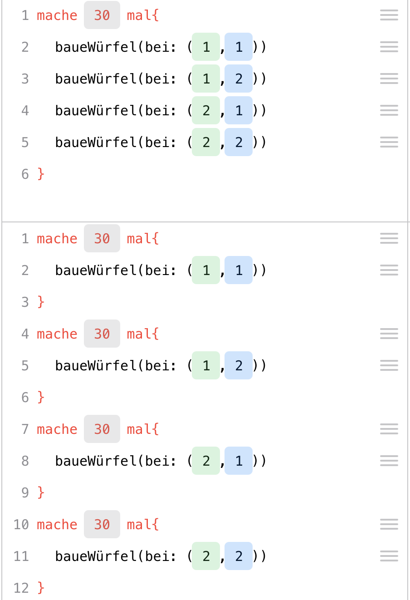
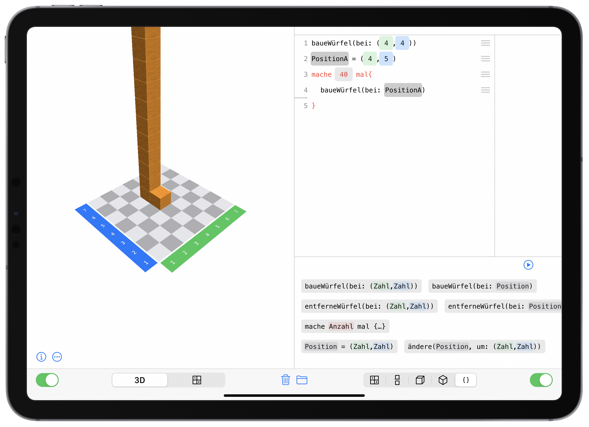

# Programming with Cubeling {#Coding}

The goal of this section is not to turn your students into programmers with the help of digital cubes. Rather, the aim is to develop a **feeling for an algorithmic perspective** on building connected cube structures and to focus on the **process of building**. This process is documented, made *translatable* for a computer, and, through the use of basic programming structures like loops, the **potential of these structures** is made visible using the example of cube structures.

Cubeling's code view was developed in connection with a trial at a school in Brandenburg. Based on the experiences gained in that project week, this chapter presents a possible sequence of four teaching blocks that can be used to explore the programming in the Cubeling app. Of course, a more spread out and gradual incorporation into math lessons is also possible.


## Einordnung und Ziele

Programming with Cubeling addresses both mathematical and media informatics skills.

***Mathematics Educational Standards.*** With regard to the educational standards for primary school level [KMK, -@KMK:2005], the competency of **representation** is particularly encouraged: Students can create, select, and use appropriate representations for working on mathematical problems and can compare and evaluate representations with one another. Also at secondary school levels [KMK, -@KMK:2004], the concept furthers the competencies **use of mathematical representations** (especially creating and using standard representations/models of mathematical objects and situations, interpreting or modifying given representations reasonably, evaluating different representations and forms of representation in a purpose-oriented way) and **dealing with symbolic, technical, and formal elements of mathematics** (here, specifically, using mathematical aids and digital mathematical tools directly, applying formal mathematical procedures, and selecting and using digital mathematical tools efficiently depending on the situation and purpose).

This is all implemented in the app's concept particularly with the **guiding principle of space and shape** in mind.

The individual tasks most definitely also address numerous other general and content-related mathematical competencies, but the ones mentioned here represent the main goals of the concept.

***KMK: Education in the digital world.*** The concept also contributes to fulfilling some of the competencies that were issued by the Standing Conference of the Ministers of Education and Cultural Affairs conference in their strategy for "Education in the digital world" [KMK, -@KMK:2016]. Particularly noteworthy here are: **Recognizing and formulating algorithms** (5.5), **Knowing and understanding operating principles and basic principles of the digital world** (5.5.1), **Recognizing and formulating algorithmic structures in the digital tools used** (5.5.2), and **planning and using a structured, algorithmic sequence to solve a problem** (5.5.3).

***D-EDK: Media and Informatics.*** In the Curriculum 21 on the subject of "Media and Informatics" [D-EDK, -@D-EDK:2016] issued by the German-Swiss conference of Directors of Education, some more detailed goals for education in connection with digital media are stated, which are targeted when programming with the Cubeling app.  Particular emphasis in put on the following competencies (MI2.2): Students can **read and manually execute simple sequences with loops and parameters**; they understand that a **computer can only execute predefined instructions** and that a **program is a sequence of such instructions**; they can **write and test programs with loops and parameters**; they can **formulate their own algorithms in the form of functioning and correct computer programs with variables**; and they can **compare and evaluate different algorithms for solving the same problem**.

> Self-discovery is of particular importance here. The experiences gained in cube building tasks lead to the discovery of general methods, which can be tested for effectiveness and efficiency during programming and possibly improved. The fact that this has to be done in a playful and action-oriented way is realized by the building of cube structures and the links to experiences from math lessons.


## Einführung in Beschreib-Prozesse/ Introduction to processes of description

You will need:

> about 10 small wooden cubes per student,  
> dice,   
> iPads with the Cubeling app installed,  
> [Worksheet](files/Cubeling-Worksheet-v2-de.pdf){target="_blank"} (Tasks 1 to 4)  
> possibly [Presentation with tasks](files/Cubeling-Tasks-v2-de.pdf){target="_blank"}

Recommended app settings: 

> Number of rows/columns: 7,  
> Wooden cubes,  
> Show coordinate numbers and colored axes,  
> No loops or variables  


### Motivations- und Kennenlernphase/Motivation and familiarization phase


Since we carried out this project in a class that was unfamiliar to us, we preceded the actual topic of the lesson with a familiarization phase. This phase, of course, also included mentions of cubes. If you already know the class, you can use similar tasks for motivation, perhaps also as homework, or you omit this phase altogether.


As a warm-up and a means to get to know each other, the students were given the following task: 
  
```{block, type="task"}
**Task**  
Toss a die and do all actions that are assigned to a number less than or equal to the one you rolled:  
**1** Make yourself a name tag!  
**2** Write an adjective in front of your name that begins with the same letter as your first name! 
**3** Draw a small picture on your name tag that has something to do with your favorite hobby! 
**4** Estimate how many cubes each of your classmates would have to take out of the box so that all children have the same number of cubes. Write this number on your name tag!  
**5** Think about what animal living in the forest you would most like to be and draw or write it on your name tag!  
**6** Try to recreate this animal using the cubes. 
```

A large box with wooden cubes was placed on the teacher's desk. We used wooden cubes of the size 2 x 2 x 2 cm.^[for example ones found on [www.holzwuerfel.com](http://www.holzwuerfel.com)]

The first pragmatic purpose was of course the creation of the name tags. In addition, this task also includes the deliberate estimation of quantities, and the last task even already touches on/links to the upcoming activities with the cubes. 

This phase already allows for various differentiation possibilites: Students who were able to finish their (few) tasks earlier can help others or complete further tasks voluntarily.

### Setting/formulating the goal

After this activity, the goal of the project was explained, namely that cube structures are to be created with the help of computers. As a small preview of what creative realms this can lead to, the popular game "Minecraft" was referenced, to which students reacted enthusiastically. Concrete knowledge about the computer game on the part of the teacher is not necessary. It is merely a matter of motivating the students and finding ties to their own lives.

```{block, type="hint"}
**Lesson goal**  
We want to use computers to build connected cube structures. The computer helps us to build relatively complex structures in a quick way.
```

### Describing a cube
Since computers are not "thinking entities/beings" per se, they always need to be told exactly what to do. This situation was playfully analogized by a fictitious encounter with an alien.

```{block, type="task"}
Imagine an alien standing in front of your door tomorrow morning. It has learned your language quickly due to its high intelligence, but its culture only has it knowing about round shapes. For your new board game, however, you need a cube/die?. Try to explain to the creature what a cube/die is.

Act out the situation with the person sitting next to you by pretending to be the alien! The alien here is completely unknowledgeable and should ask critical questions, if it does not understand something. Afterwards, switch roles.
```

Especially the last point should be emphasized by the teacher, because the students in our session tended to take their previous knowledge as given and "probed" the other student less. But that is exactly the goal of the exercise! The point is to describe the shape of a cube as clearly and precisely as possible, so that everyone is able to unambiguously conceive this object. The alien serves as a representative object, for which it is necessary to describe with exactness.

Due to the openness of the task, there is no one correct solution. Therefore, in our case, the students tried to draw, build, or use terms like "corners", "sides", or "edges" to describe the shape. Depending on how much time you want to take for this task, you could discuss when a cube is mathematically unambigously defined or not. It is important to work out the different ways the descriptions were expressed/presented: verbally, through gestures, graphically, crafting, ... In each of these cases, it can be discussed that an unambiguous, unequivocal description is not so easy. The advantages and disadvantages of each mode of describing can also be discussed. Describing cubes, cube structures, or the building process itself will be a common thread throughout the entire lesson. The alien situation has demonstrated the necessity of describing and can now be referred back to in the further course of the lesson.

### Beschreiben von Würfelbauwerken

Der nächste Schritt ist nun die Beschreibung einer komplexeren Form: eines Würfelbauwerkes. Folgende Aufgabenstellung wurde den Schülerinnen und Schülern gegeben:

```{block, type="task"}
Stelle zwischen dir und deinem Banknachbarn oder deiner Banknachbarin einen Sichtschutz auf. Du denkst dir ein Würfelgebäude mit 10 Klötzchen aus und baust es vor dir auf! Erkläre deinem/deiner Partner/-in, wie er/sie dieses Gebäude bauen kann! Vergleicht anschließend und tauscht die Rollen!

Welche Probleme sind beim Beschreiben des Bauprozesses entstanden?
```

Ziel dieser Aufgabe ist der Ansatz, dass es hilfreich sein könnte, nicht nur das fertige Gebäude zu beschreiben, sondern den Prozess der Entstehung darzulegen. Außerdem wird die Entwicklung eines „Befehlssystems“ trainiert: Die Schülerinnen und Schüler mussten sich sehr genau überlegen, welche Handlungsanweisungen sie ansprechen, ohne missverstanden zu werden. Ähnlich wie bei der Aufgabe zuvor, entstanden die verschiedensten Lösungsansätze. So unterteilten die Kinder ihre Figur in kleinere „leichtere Einheiten“, wie etwa eine Reihe, einen Turm oder einen 2x2x2-Würfel. Es fielen sogar interessante Anweisungen, wie „Lege ein 2x4-Rechteck!“ Ein weiterer Ansatz war es, die Steine und Positionen auf dem Tisch zu nummerieren – ähnlich eines Koordinatensystem oder eines Schachbrettmusters. Die meisten waren sich beim Zusammentragen in der Klasse einig, dass es am sinnvollsten sei, zu Beginn ein Klötzchen zu legen und dann von diesem mit Richtungen zu beschreiben, an welche Seite wie viele Würfel angelegt werden sollen. Eine Gruppe ließ sogar nicht nur „bauen“, sondern beschrieb eine größere, einfache Form und ließ von dieser dann Würfel entfernen.

Viele dieser Ideen und Herangehensweisen sind nützlich, um beim späteren „Programmieren“ auf sie zurückzugreifen. So ist beispielsweise das Zerlegen in „kleinere Einheiten“ ein wesentliches Vorgehen in der Informatik und spiegeln sich beim Klötzchen-Programmieren wider (z. B. beim Bauen einer Reihe mittels Wiederholungschleifen). Die Idee des Nummerierens wird in der App besonders durch das Schachbrettmuster und den Wunsch nach einer konkreten Verortung der Klötzchen deutlich. Durch Positionen und Verschiebungen kann man genau sagen, in welche Richtung wie viele Klötzchen gebaut werden sollen und auch die Idee des Entfernens von Würfeln aus einer größeren Form wird sich in ähnlicher Form in einer Übungsaufgabe wiederfinden.

### Freie Erkundung der App

Verglichen mit der Alien-Situation soll nun das iPad als „Alien“ betrachtet werden: Ihm muss genau beschrieben werden, wie es ein bestimmtes Würfelgebäude bauen soll. Dazu durften die Kinder (nach einer kurzen Belehrung zum Umgang mit den iPads) zu zweit 10 Minuten lang beliebig mit der App „Klötzchen“ experimentieren. Auf allen iPads wurde die Anzahl der Zeilen/Spalten in den Einstellungen auf 7 festgelegt, Schleifen und Variablen wurden zunächst deaktiviert und als Art der Würfel wurden die „Holzwürfel“ festgelegt.

```{block, type="task"}
Stellt euch vor ihr seid Architekten und wollt einem Computer ein Würfelgebäude beschreiben, damit dieser es darstellen kann. Eindeutigkeit und Klarheit sind hierbei von besonderer Bedeutung.

Findet heraus, was die Klötzchen-App alles kann.
```

Das freie Experimentieren trainiert die schnelle Auffassungsgabe von Kindern und ermöglicht grundsätzlich jedem, sich in seiner eigenen Geschwindigkeit auf eine neue (in diesem Fall virtuelle) Umgebung einzustellen und sich mit dieser vertraut zu machen. Um die Kommunikation zu steigern und damit nicht so viele technische Geräte benötigt werden, können die Kinder zu zweit arbeiten.

Anschließend wurden in einem Unterrichtsgespräch die wichtigsten Funktionen der App zusammengetragen. Dabei ist es noch nicht wichtig, jedes kleine Detail zu erklären. Die wichtigsten Fragen, die in dieser Runde geklärt werden sollten, sind folgende:

```{block, type="hint"}
- Welche Ansichten gibt es, wie heißen sie und wie wechsle ich zwischen ihnen?
- Wie baue oder entferne ich Klötzchen in der 3D-Ansicht und im Bauplan?
- Wie baue oder entferne ich Klötzchen in der Code-Ansicht?
- Wie kann ich eine Seite ausblenden?
- Wie entferne ich alle Würfel (und auch die Codes) auf einmal?
- Wofür stehen die Farben blau und grün?
```

Diese Fragen sind insofern wichtig, als dass die Schülerinnen und Schüler so die wichtigsten Funktionen kennenlernen und man sich im weiteren Verlauf des Projektes mithilfe der Fachbegriffe für die verschiedenen Ansichten verständigen kann.

Die Code-Ansicht ist damit eine weitere Möglichkeit (neben den in der Regel schon bekannten), Würfelbauwerke darzustellen. Diese Ansicht hat an dieser Stelle noch nicht zwingend eine besondere Bedeutung, sondern ist eben nur eine von vielen. Welche Mächtigkeit sie eigentlich besitzt, wird erst im weiteren Verlauf noch erarbeitet.

### Übungen zum Bauen von Würfelbauwerken

Darauf folgte die erste Übungsphase, in der eine vertiefende Beschäftigung mit der App im Fokus stand. 


```{block, type="task"}
Bearbeite die Aufgaben 1 bis 4 des [Arbeitsblattes](files/Cubeling-Worksheet-v2-de.pdf){target="_blank"}!
```

Mit den Aufgaben 1 bis 4 des Arbeitsblattes werden strukturiert die einzelnen Ansichten und Funktionsweisen der App durchgearbeitet. Auch fließen einige Praxisbezüge (z. B. das Schreiben von Buchstaben auf einem karierten Muster mithilfe von Blöcken, wie an den Anzeigen in der Bahn) mit ein und können mündlich thematisiert werden. Bei Aufgabe 3 („Baue ein größtmögliches X!“) wird bereits eine Besonderheit sichtbar: So ist es in der Code-Ansicht theoretisch möglich, über das 7x7-Feld hinauszubauen und somit ein „unendlich“ großes X zu bauen. Dies ist natürlich praktisch nicht realisierbar und selbst eine Größe von 100 Kästchen in jede Richtung ist ohne die Wiederholungsschleife ausgesprochen mühsam. Diese Problematik wird auch im Aufgabe 4 noch einmal aufgegriffen („Was passiert, wenn ich einen Würfel außerhalb des gegebenen Bereiches baue?“) Die Aufgabe dient insgesamt dem besseren Verstehen der Konzeption der Code-Ansicht der App. Die Schülerinnen und Schüler sollen nicht nur die App verwenden können, sondern auch verstehen, weshalb einige Funktionsweisen oder grafische Symbole so sind, wie sie in der Umgebung dargestellt werden.


## Arbeiten mit der Code-Ansicht

Du benötigst:

> iPads mit der Klötzchen-App,  
> [Arbeitsblatt](files/Cubeling-Worksheet-v2-de.pdf){target="_blank"} (Aufgaben 5 bis 7)  
> ggf. [Präsentation mit Aufgabenstellungen](files/Cubeling-Tasks-v2-de.pdf){target="_blank"}

Empfohlene App-Einstellungen: 

> Anzahl der Zeilen/Spalten: 7, 
> Holzwürfel,  
> Achsenmarkierung und farbige Achsen an,  
> Schleifen und Variablen aus  


### Analyse der Code-Ansicht

Sobald die ersten Schülerinnen und Schüler die Aufgaben 1 bis 4 beendet hatten, wurde Aufgabe 4 gemeinsam an der Tafel besprochen. Aufgaben 1 bis 3 lassen sich nur schwer vergleichen und es gab hier auch nur wenig Gesprächsbedarf. Kleinere Fragen, insbesondere der Funktionsweise der App, wurden meist schon während der Einzelarbeit geklärt.

Bei der Besprechung von Aufgabe 4 lag der Fokus darauf, die Ablaufverfolgung kennenzulernen. Diese wird in den kommenden Aufgaben und zur Visualisierung von Schleifen benötigt. 

{width=50%}
An dieser Stelle bieten sich auch Anknüpfungspunkte zur Behandlung von negativen Zahlen und die Beschreibung von Orten in der Ebene mithilfe eines speziellen Koordinatensystems. Wir sind hierbei nicht in die Tiefe gegangen, sondern haben eher intuitiv damit gearbeitet, was den Schülerinnen und Schülern aber keine Schwierigkeiten bereitete. Unterstützung bieten hier die veränderlichen Variableneinträge: Tippt man in der Code-Ansicht auf eine Koordinate, so kann man diese über die grünen bzw. blauen Pfeile schrittweise verändern – auch in den negativen Bereich. 

<!-- <center> -->
<!-- </center> -->
Die Entscheidung, sowohl in positiver als auch in negativer Richtung über das Feld hinausbauen zu können, wurde seitens der App-Entwickler nicht zuletzt zur Vermeidung von Fehlercodes getroffen: Spätestens bei größeren Schleifen würden sonst Probleme entstehen. Prinzipiell ist die App so konzipiert, dass kaum Fehler entstehen und auf diejenigen, die entstehen können, wird in den Fragen bei Aufgabe 4 aufmerksam gemacht. Es gilt hierbei, die Kinder zu ermutigen, Fragen wie „Was passiert, wenn … ?“ zu stellen. Fehlerhafte bzw. unvollständige Code-Zeilen werden nicht ausgeführt.


### Nutzung der Code-Ansicht
Im Anschluss daran haben die Schülerinnen und Schüler die Rückseite des Arbeitsblattes bearbeitet. 

::: {.task}
Bearbeite die Aufgaben 5 bis 7 des [Arbeitsblattes](files/Cubeling-Worksheet-v2-de.pdf){target="_blank"}!
::: 

Bei Aufgabe 5 (Spiegelung eines Würfelgebäudes in der Code-Ansicht) geht es zunächst darum, die mathematische Struktur für die Spiegelung zu erkennen. Die Frage nach der Übertragung auf 8x8- oder 9x9-Felder soll hier verstärkt motivieren, den Zusammenhang zu verallgemeinern und die dahinterliegende Gesetzmäßigkeit zu entwickeln. Bei dieser Gelegenheit haben wir der Klasse auch gezeigt, wie man die Feldgröße in den Einstellungen auf bis zu 10x10 Felder erhöhen kann. Bei unserer Durchführung haben einige Schülerinnen und Schüler die Zahlenpaare 1 und 7, 2 und 6, 3 und 5, … gefunden und auch intuitiv einen Zusammenhang erkannt. Aber erst durch die Hilfestellung „Was ergeben die beiden Zahlen denn zusammen?“ konnten diese dann auch die Gesetzmäßigkeit formulieren. An der Tafel wurde der Zusammenhang folgendermaßen notiert:

<center>
*grün*<sub>alt</sub> + *grün*<sub>neu</sub> = 8 also *grün*<sub>neu</sub> = 8 – *grün*<sub>alt</sub>
</center>

bzw. verallgemeinert, wenn *n* die Anzahl der Zeilen/Spalten ist:

<center>
*grün*<sub>alt</sub> + *grün*<sub>neu</sub> = *n* + 1 also *grün*<sub>neu</sub> = *n* + 1 – *grün*<sub>alt</sub>
</center>

Ob hier tatsächlich schon mit den Variablen *n*, *grün*<sub>alt</sub> und *grün*<sub>neu</sub> gearbeitet werden kann, hängt natürlich stark von der Klasse ab. Aufgrund des konkreten Bezugs zu den gebauten Würfeln bestanden bei unserer Durchführung jedoch keine Schwierigkeiten. Interessanterweise ist dieser Zusammenhang unabhängig davon, ob n gerade oder ungerade ist – auch wenn im geraden Fall keine Würfel auf der Spiegelachse liegen können, im ungeraden dagegen schon.

Bei Aufgabe 6 (schrittweises Ergänzen von Code zum Bauen von drei Würfelbauwerken) müssen von Gebäude 1 zu Gebäude 2 Klötzer ergänzt und zu Gebäude 3 Klötzer entfernt werden. Ziel ist es, einen ersten Einblick darin zu gewinnen, dass bei der Entstehung eines Gebäudes bereits mehrere „Teilgebäude“ entstehen. Im Code ist dieser Werdegang leicht nachvollziehbar.


<center>
{width=75%}
</center>


Aufgabe 7 haben wir als Zusatzaufgabe für schnellere Schülerinnen und Schüler genutzt. Dabei generierten sich die Kinder eigene Gebäude. Zur weiteren Differenzierung können Sie nach „besonders schwierigen“ Ansichten fragen. Es kann thematisiert werden, dass einige Ansichten nicht eindeutig sind und man daher leicht den Gegner verwirren kann. Unterstützende Fragen sind hier: 

::: {.hint}
- Welche Ansichten sind eindeutig? 
- Warum kann ich nicht in allen Ansichten per Touch bauen? 
- Kann ich zwei verschiedene Gebäude bauen, die das gleiche Zweitafelbild, das gleiche Schrägbild oder die gleiche Isometriedarstellung besitzen? 
:::

Dass nicht in allen Ansichten per Touch gebaut werden kann, liegt genau an der Eindeutigkeit. So ist nur die 3D-Ansicht und – bei Holzwürfeln – die Bauplan- und Code-Ansicht eindeutig. Diese Diskussion bietet einen guten Übergang von den Inhalten des Mathematikunterrichts (Eindeutigkeit von Darstellungen, Beschreibungen) zur Code-Ansicht in der App und damit zum Programmieren und Algorithmisieren. Das Coding (oder Programmieren) ist damit „nur“ eine zusätzliche Darstellungsform und am Beispiel der Würfelbauwerke für die Kinder leicht zugänglich.

### Unterscheidung von Prozess und Produkt

In der zweiten Hälfte der Unterrichtsstunde geht es um die Unterscheidung zwischen „Prozess“ und „Produkt“. Dazu haben wir ein relativ einfaches Gebäude aufgebaut und die Klasse erhielt folgende Aufgabe:

::: {.task}
Baut das Würfelgebäude in der Code-Ansicht! 
{width=20%}


Vergleiche dein entstandenes Gebäude mit dem deines Nachbarn bzw. deiner 
Nachbarin! Folgende Fragen können dir helfen:

- Ist dasselbe Gebäude entstanden?
- Sieht es so aus wie vorne auf dem Tisch?
- Liegt das Gebäude am selben Ort?
- Gibt es in einer der verschiedenen Ansichten einen Unterschied?
- Ist ein Gebäude „besser“ konstruiert, als das andere? 
Was könnte „besser“ in diesem Zusammenhang bedeuten?
:::

In den meisten Fällen entstand dasselbe Gebäude wie vorn auf dem Lehrertisch aufgebaut. Aufgrund eines nicht vorhandenen Koordinatensystems stand das Gebäude allerdings an verschiedenen Orten. Außerdem ist es möglich, die einzelnen Würfel des Gebäudes in einer anderen Reihenfolge zu bauen und es könnten Fehler (also zum Beispiel falsch gesetzte Klötzchen) korrigiert worden sein, was in der Code-Ansicht immer noch zu sehen ist. Besonders die Code-Ansicht dürfte hier hervorstechen, da sie nicht nur die einzige immer eindeutige Ansicht ist, sondern in ihr auch Informationen über den Prozess der Entstehung gespeichert werden. 

Die Diskussion über eine „bessere“ Konstruktion kann hier wunderbar zu den Vorteilen des „Codings“ führen. Dazu wurden die Schülerinnen und Schüler an die Ausgangssituation („Stellt euch vor, ihr seid Architekten“) erinnert. So können die Länge des Codes (möglichst wenig Fehler) als Bewertungskriterium oder die Reihenfolge der Planung des Baus eines Gebäudes von Bedeutung sein. Um das zu verdeutlichen kann ein Schüler oder eine Schülerin gebeten werden, auf dem Lehrertisch eine kleine Mauer aus Holzklötzen zu bauen. Wahrscheinlich wird er oder sie der Stabilität wegen nicht einzelne kleine Türme bauen und zusammensetzen, sondern eher Reihen übereinanderstapeln. Die Reihenfolge kann also in der Praxis relevant sein.
	
<center>
{width=75%}
</center>


Abschließend kann die Diskussion folgendermaßen zusammengefasst werden:

::: {.hint}
Die Code-Ansicht liefert uns im Vergleich zu allen anderen Ansichten nicht nur eine eindeutige Darstellung des Gebäudes, sondern zusätzlich auch eine Beschreibung des Entstehungsprozesses.
:::

Die Vorstellung, dass ein Programm oder ein Algorithmus eine festgelegte Abfolge von eindeutig formulierten Handlungsabläufen darstellt, ist grundsätzlich und bedeutsam in vielen Unterrichtsfächern. Auch wenn die informatischen Begriffe an dieser Stelle noch nicht diskutiert werden müssen (aber können), so wird doch eine intuitive Vorstellung von ihnen entwickelt, was in den folgenden beiden Unterrichtsblöcken durch Schleifen und Variablen vertieft wird.

Weiterhin wurde über die Anzahl der Möglichkeiten gesprochen, die es gibt, um das Gebäude zu bauen:

::: {.task}
- Wie viele verschiedene Wege gibt es, das Gebäude ohne Entferne-Befehl zu bauen?
- Kann ich zwei Befehle beliebig vertauschen, wenn ich nur das Ergebnis betrachte?
- Versuche, das Gebäude mit genau 20 Befehlen zu bauen! Ist das überhaupt möglich? Welche Anzahlen an Schritten sind möglich?
:::

Diese Übung greift auch schon kombinatorische Überlegungen mit auf. Dabei ist es jedoch gar nicht so relevant, die korrekte Anzahl an Möglichkeiten zu bestimmen. Vielmehr soll den Schülerinnen und Schülern bewusst werden, dass es verschiedene Möglichkeiten gibt und daher der Code den Prozess des Bauens beschreibt.


## Schleifen und Laufvariablen

Du benötigst:

> iPads mit der Klötzchen-App,  
> ggf. [Präsentation mit Aufgabenstellungen](files/Cubeling-Tasks-v2-de.pdf){target="_blank"}

Empfohlene App-Einstellungen: 

> Anzahl der Zeilen/Spalten: 10, 
> Holzwürfel,  
> Achsenmarkierung und farbige Achsen an,  
> Schleifen und Variablen an


### Einführung von Wiederholungsschleifen

In diesem Unterrichtsblock wurden Wiederholungsschleifen und Laufvariablen auf anschauliche und verständliche Weise vermittelt. Den Schülerinnen und Schülern sollte vermittelt werden, wie hilfreich diese Strukturen sind, um einen kürzeren und somit „besseren“ Code zu kreieren. Auch wird die Leistungsfähigkeit eines Computers und speziell eines Programms besonders deutlich hervorgehoben. Zu diesem Zweck befassten wir uns insgesamt vier mal mit dem Erbauen einer Mauer und verbesserten dabei stets die Herangehensweise. 


***1. Mauerbau: Ohne Schleife.*** Zu Beginn erhielten die Schülerinnen und Schüler folgende Aufgabe:

::: {.task}
Baue eine Mauer, die 11 Klötzchen lang und 6 Klötzchen hoch ist!
:::

Die Aufgabenstellung zwingt indirekt zur Nutzung der Code-Ansicht, da nur in ihr über die 10x10 Felder hinweg gebaut werden kann.

{width=50%}
Anschließend wurde thematisiert, dass es ausgesprochen umständlich und aufwendig zu sein scheint, ein solches von seiner Struktur her einfaches Gebäude zu realisieren. Als Motivation und Ausblick kann der Klasse kurz gezeigt werden, wie am Ende der Stunde das Gebäude mit nur 7 statt der bisherigen 66 Zeilen gebaut werden kann. Außerdem kann man die Klasse damit verblüffen, wie leicht man die Höhe oder Länge der Mauer mit den roten Pfeiltasten beliebig verändern kann. Dies löste merkliches Staunen und Ehrgeiz in der Klasse aus, womit es sich in diesem Fall als geeigneten Unterrichtseinstieg erweist, auf das Ziel zu verweisen.

Sprachlich lässt sich das Gebäude theoretisch viel einfacher beschreiben. Dazu kann auf die in der ersten Stunde entwickelten sprachlichen Möglichkeiten, ein Gebäude zu beschreiben, verwiesen werden: Man kann zum Beispiel sagen „Mache … x mal!“. Eine solche Aktion nennt man Schleife. Um diese in der App nutzen zu können, müssen Schleifen und Variablen in den Einstellungen aktiviert werden. Anschließend haben wir den Kindern gezeigt, wie sich leicht mit 2 Befehlen ein Turm der Höhe 50 bauen lässt. Dabei wird ihnen auch die Bedeutung der geschweiften Klammern erklärt (all das, was darin steht, wird wiederholt) und wie sie die Anzahl der Wiederholungen mithilfe der roten Pfeile verändern können (ähnlich wie die Variablen bei Koordinatenangaben). Selbst sollen sie das ganze dann an folgendem Beispiel ausprobieren:

::: {.task}
Baue einen dicken 2x2-Turm der Höhe 30!
:::

Für die Schülerinnen und Schülern ungewohnt war hier die Reihenfolge der Befehle. Würde man natürlicherweise eher „Baue auf Feld … und tue dies … mal!“ sagen, so muss im Code zunächst die Anzahl der Wiederholungen eingegeben werden („mache … mal“) und erst anschließend wird der eigentliche Baue-Befehl in die geschweiften Klammern hinzugefügt. Durch das Verschieben von Code-Zeilen in die Schleife hinein kann dies aber auch im Nachhinein erfolgen.

{width=50%}
Die Aufgabe bietet ebenso wieder eine Diskussion zu einem möglichst „guten“ Code an. So produzieren die in den Abbildungen dargestellten Codes beide dasselbe Endprodukt. Zur Diskussion dieser beiden Möglichkeiten bietet sich die Ablaufverfolgung an. Wir haben hierfür zwei iPads mithilfe der Software „Reflector“ gleichzeitig an die Tafel projiziert und dann haben die Kinder abwechselnd immer Schritt für Schritt die Ablaufverfolgung gezeigt. Dabei wurde sichtbar, dass in der oberen Variante der Turm „etagenweise“ gebaut wird, in der untern Abbildung „turmweise“. Erstere Variante ist damit nicht nur im Code deutlich kürzer, sondern auch für die Reihenfolge des Bauens wesentlich stabiler. Dies führte zum Erstaunen vieler Schülerinnen und Schüler, denn auch diejenigen, die die erste Variante programmiert haben, rechneten nicht unbedingt damit, dass auf alle vier Felder jeweils ein Klötzchen gelegt wird, bevor die nächste Etage erzeugt wird. Das liegt v. a. daran, dass der Code „live“ ausgeführt wird, d. h. wenn man innerhalb der Schleife den zweiten, dritten bzw. vierten Baue-Befehl eintippt, wird der komplette Code sofort ausgeführt und man sieht in der 3D-Ansicht immer nur die neu hinzugekommenen Würfeltürme – nicht jedoch die Reihenfolge ihrer Entstehung.

Natürlich bleibt zu erwähnen, dass die zweite Variante nicht grundsätzlich falsch ist. Sie ist lediglich weniger geschickt. Die Unterscheidung zwischen Prozess- und Produktbetrachtung aus dem letzten Unterrichtsblock wird hier erneut deutlich.
Wahrscheinlich werden die Kinder in ihrem spielerischen Eifer versuchen, die Höhe des Turms auszureizen. Hier stößt allerdings auch das iPad an seine Grenzen, so dass bspw. bei 500-facher Wiederholung zu einem Absturz der App kommen kann. In dem Fall muss man sie vollständig schließen und wieder öffnen.

***2. Mauerbau: Schleife ohne Laufvariablen.*** Nachdem die Schülerinnen und Schüler Schleifen kennengelernt haben, können sie nun die 11x6-Mauer erneut bauen. Dies ist (solange man keine Doppelschleifen verwendet) mit elf Schleifen der Art „mache 6 mal“ möglich – dies sind dann insgesamt 33 Code-Zeilen.    

### Erkundung von Laufvariablen

Die Nutzung von elf Schleifen ist zwar schon deutlich besser, aber noch nicht optimal. Um sich weiter zu verbessern, erhält die Klasse zehn Minuten Zeit, um folgende Aufgabe durch Probieren und Experimentieren zu bearbeiten:

::: {.task}
Erkunde selbst, was man mit den Befehlen `setze` und `ändere` machen kann!
:::

Ähnlich wie im ersten Unterrichtsblock stand das Entdecken durch Probieren im Vordergrund. Interessant war der Umstand, dass die Schülerinnen und Schüler die Funktionen bereits etwas zielstrebiger als noch im ersten Unterrichtsblock einsetzten. Die Frage „Was passiert, wenn ich …?“ war deutlich häufiger zu vernehmen, als noch in den letzten Unterrichtsstunden. Das kann natürlich auch daran liegen, dass die Klasse hier lediglich zwei Funktionen im Gegensatz zu einer völlig neuen App erkunden sollten. Dennoch hat sich diese Herangehensweise nach unserer Wahrnehmung verbessert.

### Systematische Behandlung von Laufvariablen

Zur Erarbeitung der Laufvariablen haben wir uns kurz vom Tablet entfernt und das „Spiel der Bauarbeiter/-innen“ gespielt. Ziel war es, eine erste Vorstellung der Variablen (in der App „Positionen“ genannt) und deren Änderung („ändere um …“) während des Bauprozesses zu veranschaulichen. Hierfür nutzten wir analog zur App ein 7x7-Feld auf einer Teppichmatte. Die Linien wurden ebenso gestaltet, dass sie denen in der App entsprechen. Ein solches Feld lässt sich aber auch relativ schnell mit Malerkrepp auf dem Fußboden im Klassenraum herstellen. Außerdem besaßen wir einen Satz großer Holzklötze (12 x 12 x 12 cm), die exakt in die Felder des gezeichneten Spielplans passten. Einige Schülerinnen und Schüler erhielten Bauarbeiterhelme, versehen mit den Buchstaben A bis D. 
{width=50%}
Diese vier Schülerinnen und Schüler erhielten zusätzlich ein Schild um den Hals, auf dem sie ihre derzeitige Position mit grüner und blauer Farbe eintragen können (hierfür eigenen sich laminierte Blätter, auf denen mit abwischbaren Folienstiften geschrieben wird). Die umstehenden Kinder haben dabei geholfen, sodass diese Tätigkeit nicht allzu viel Zeit in Anspruch nahm. Zusätzlich gab es eine Bauaufsicht (mit anderer Helmfarbe). Die Lehrkraft dient nun als Architekt bzw. Architektin, indem sie einen Code vorgibt. Die Aufgabe der Bauaufsicht ist es dann, die Bauarbeiterinnen und Bauarbeiter anzuweisen, welche Position sie jeweils einzunehmen haben und wo demnach ein Würfel gebaut bzw. entfernt werden soll. Anschließend konnte das fertige Bauwerk mit dem in der 3D-Ansicht am Tablet verglichen werden.

Durch dieses Spiel wird die Dynamik des Prozesses erkennbar. Die Bauarbeiterinnen und Bauarbeiter stehen für die im Code gesetzten Positionen, die sich im Laufe des Bauprozesses verändern. Die Bauaufsicht hat die Aufgabe, den Code korrekt auszuführen, also bspw. die Anzahl der Durchgänge von Wiederholungsschleifen zu zählen. Natürlich kann dieses Spiel im weiteren Verlauf mit verschiedenen Rollen beliebig ausgeschmückt werden.

Anschließend können natürlich sämtliche Rollen auch mit anderen Schülern und Schülerinnen besetzt werden, sodass alle Kinder einmal praktische aktiv geworden sind. Evtl. bietet es sich sogar an die Klasse in 2 Gruppen zu teilen und 2 Spielfelder vorzubereiten, da sonst einfach zu viele Personen um das Feld stehen und sich sogar gegenseitig die Sicht klauen können. 
Für uns überraschend war, dass die Schülerinnen und Schüler kaum Probleme mit dem „ändere“-Befehl hatten, obwohl die in ihm angegeben Koordinaten eine Verschiebung und keine Position mehr darstellen. Der Befehl unterstützt dies durch die Bezeichnung „ändere(…, **um**: …)“, während Positionen mit „baueWürfel(**bei**: …)“ bezeichnet werden. Das Spiel bietet durch das explizite Ausrechnen der neuen Positionen Erfahrungen im Umgang mit den Befehlen. Außerdem wird auch in der Ablaufverfolgung der App angezeigt, wie der jeweils aktuelle Wert einer Position ist. Die unterschiedliche Nutzung der Koordinaten für Positionen und Verschiebungen ist vergleichbar mit den Orts- und Richtungsvektoren in der Sekundarstufe II.

Bei unserer Durchführung sind im anschließenden Unterrichtsblock einige Schülerinnen und Schüler, die Schwierigkeiten mit ihrem Code hatten, selbstständig zum Teppich gelaufen und haben dort den Bauprozess noch einmal nachvollzogen. Du solltest also als Lehrkraft, wenn der Platz es hergibt, dieses Feld (oder als Alternative eines mit kleinen Holzwürfeln) dauerhaft zur Verfügung stellen.

***3. Mauerbau: Schleife mit Laufvariablen.*** Dank der Laufvariablen, benötigt die 11x6-Mauer nun nur noch 6 Schleifen der Art „mache 11 mal“, wobei vor jeder solchen Schleifen eine Position festgelegt wird, an der dann innerhalb der Schleife gebaut und die innerhalb der Schleife um `(1,0)` verschoben wird. Der Code reduziert sich damit weiter auf 30 Code-Zeilen.   


## Vertiefende Übungen

Bis hierhin haben die Schülerinnen und Schüler nun die gesamte App kennengelernt und sollten mit deren Handhabung zurechtkommen. Ziel dieses Blockes was nun das intensive Üben und die tatsächliche Arbeit an mathematischen oder programmiertechnischen Problemen.


### Übungen zu Laufvariablen
Der erste Schritt ist nun, vom leidlichen Ausführen des Codes hin zur eigenen Erstellung nach bestimmten Mustern zu gelangen. Die Anwendung der Laufvariablen stellt hierbei das komplexeste Thema dar und erfordert erwartungsgemäß einiges an Übung. So haben wir zu Beginn der Stunde kurz mündlich wiederholen, was man mit den Befehlen „setze“ und „ändere“ machen kann. Anschließend erhielten die Schülerinnen und Schüler folgende Aufgabe:

::: {.task}
Baue ein Klötzchen auf einem beliebigen Feld!
Baue von diesem Feld aus eine Reihe mit 40 Klötzchen in folgende Richtungen:  
- nach rechts  
- nach vorn  
- nach links  
- nach hinten  
- diagonal nach vorn rechts  
- diagonal nach vorn links  
- diagonal nach hinten links  
- diagonal nach hinten rechts
:::

Je nach Sichtweise auf die 3D-Ansicht kann man auch von „oben“ statt „vorn“ und „unten“ statt „hinten“. Wir nutzten erst die Bezeichnung „oben“, weshalb einige Schülerinnen und Schüler jedoch in die Höhe gebaut haben.

Insgesamt ergibt sich ein Muster, das an einen Stern erinnert. Das Endprodukt haben wir auch an die Tafel projiziert. Die Übung scheint sehr aufwendig zu sein und macht im ersten Moment den Eindruck, dass immer wieder stupide dasselbe gemacht werden müsste. Allerdings war es für die Schülerinnen und Schüler an der Stelle eine große Herausforderung, die richten Änderungen der Laufvariablen einzugeben. Insbesondere die Änderung um negative Zahlen war hier – verständlicherweise – nicht intuitiv. Allerdings blieben die Kinder „am Ball“ – die Aussicht auf das fertige Würfelbauwerk scheint also Motivation genug gewesen zu sein, die Aufgabe auch erfolgreich zu lösen. 

### Diskussion zum Live-Coding

Dass die App den Code immer sofort live ausführt, soll natürlich als Hilfestellung für die Schülerinnen und Schüler gedacht sein. Allerdings kann es die Lernenden allerdings auch verwirren, was im Unterricht aufgegriffen werden sollte. Dieser Fall trat sogar relativ häufig auf. Angenommen, man baut einen Würfel auf dem Feld (4,4) und will von dort aus nun eine Reihe von 40 Klötzchen nach vorn bauen. Der fertige Code sieht folgendermaßen aus:

<center>
{width=50%}
</center>

Viele Schülerinnen und Schüler hatten auch diese richtige Idee, waren dann jedoch verwirrt, bevor sie den „ändere“-Befehl eingegeben haben:

<center>
{width=50%}
</center>

An dieser Stelle gibt einem das Live-Coding nämlich einen Turm bei (4,5) aus. Die Lernenden dachten nun, dass sie etwas falsch gemacht hätten, da sie an dieser Stelle natürlich keinen Turm haben wollten. Hier wurde dann mit der Klasse diskutiert, wieso die App dies tut. Sollten die Schülerinnen und Schüler zu sehr verwirrt werden, bietet es sich zunächst an, die linke Seite der App temporär auszuschalten und erst nach Fertigstellung des Codes zu überprüfen. Diese Live-Coding-Diskussion kann natürlich auch an anderer Stelle schon geführt werden. Wir haben sie hier aufgeführt, da es bei den 40er-Reihen im Unterricht bei besonders vielen Schülerinnen und Schülern sichtbar wurde.

### Doppelschleifen

***4. Mauerbau: Doppelschleifen.*** Die meisten Kinder fühlten sich mit der Anwendung der Laufvariablen nach dieser Übung relativ sicher. Bevor die Schülerinnen und Schüler sich nun finalen Üben widmen durften, kam es zur Auswertung des kompaktesten Weges, die 11x6-Mauer zu bauen. Durch das praktische Vorzeigen auf dem Spielfeld wurde im Unterrichtsgespräch der Code zunächst in Worten entwickelt: Man baut 6 Klötzchen übereinander und geht dann ein Feld nach rechts. Diesen gesamten Prozess muss man 11 mal hintereinander ausführen.

Die Entwicklung des Codes mit Worten war sehr hilfreich und wurde in einer „Pseudo“-Sprache an der Tafel schrittweise entwickelt:

*Schritt 1*: 
```
baue 6er-Turm 
gehe eins nach rechts
baue wieder 6er-Turm
mach das insgesamt 11 mal   
```

*Schritt 2:*
```
mache 11 mal {
	baue 6er-Turm
	gehe eins nach rechts
}
```

*Schritt 3:*
```
setze PositionA auf (1,1)
mache 11 mal {
    baue 6er-Turm bei PositionA
    ändere PositionA um (1,0)
}
```

{width=50%}
Nun galt es, diesen noch in die Klötzchen-Programmiersprache zu übersetzen, also letztlich das Bauen des Turmes noch als Code auszudrücken. Es ergibt sich eine Schleife in der Schleife. Ein Kind aus der Klasse hat diesen Code erzeugt, während sein iPad live an die Tafel projiziert wurde. Anschließend hat jeder diesen Code noch einmal für sich programmiert und überprüft, wie durch eine Änderung der 11 und 6 mithilfe der roten Pfeile leicht Zeilen oder Spalten der Mauer hinzugefügt bzw. entfernt werden können. Der Code hat sich damit auf 7 Zeilen reduziert – von ursprünglich 66.

Auch kann thematisiert werden, dass durch die Ablaufverfolgung deutlich wird, dass dieser Code nicht besonders praktisch ist, wenn es um die Stabilität beim Bauprozess geht (da eben turmweise und nicht etagenweise gebaut wird). Dies liegt an der Programmiersprache, da man für Türme die Positionen nicht verändern muss und damit Zeilen im Code spart. Als Zusatzaufgabe konnten die Lernenden am Ende der Stunde überlegen, wie der Code aussehen müsse, damit übereinander liegende Reihen gebaut werden. Ist es dann auch noch so einfach, Zeilen oder Spalten hinzuzufügen? Wieso nicht?

### Komplexe Übungen {#komplexeUebungen}

Schließlich wurde den Schülern und Schülerinnen per AirDrop Bildschirmfotos von komplexeren Gebäuden geschickt, sie sie nun mithilfe von Wiederholungsschleifen und Laufvariablen möglichst effektiv bauen sollten. Dabei wurden die Aufgaben immer komplizierter, bis hin zu einer dreifachen Schleife bei einem großen Würfel. 

::: {.task}
Programmiere die Würfelbauwerke!
:::

Auch diese Aufgaben bieten wieder das Potenzial, verschiedene Lösungswege zu diskutieren und über eine Optimierung des geschriebenen Codes nachzudenken. Gleichzeitig kann hier auch die Kreativität der Schülerinnen und Schüler beim Erstellen eigener Gebäude gefördert werden.   


## Zusammenfassung und weiterführende Möglichkeiten

Zum Schluss der Stunde wurde die Klasse gebeten, die Projektphase auszuwerten und Wünsche zu äußern. Häufig wurde beschrieben, dass sie gelernt hätten, wie praktisch und mächtig die Code-Ansicht ist und dass sie sich anfänglich gescheut hätten, mit ihr zu arbeiten, nun diese aber sogar präferieren würden („Am Anfang fand ich das mit dem Code ja nicht so spannend, da habe ich lieber in der 3D-Ansicht gebaut. Aber jetzt, wo wir die Schleifen haben, mach ich das lieber mit dem Code.“). Außerdem wünschten sich einige Kinder farbige Klötzchen in der App oder die Programmierung auch mit den Steckwürfeln, um beispielsweise Häuser mit Fenstern bauen zu können. Es war eine große Begeisterung für das Erlernen des „Architekten-Daseins“ und des Programmieren sichtbar, viele Schülerinnen und Schüler stellten auch noch nach dem Pausenklingeln Fragen, wie etwa zur alternativen Methode für die 11x6-Mauer. Außerdem wurden wir häufig gefragt, ob es eine Möglichkeit gibt, die App auch privat zu Hause nutzen zu können. Das Interesse der Klasse und die Begeisterung über diese für viele Kinder sehr außergewöhnliche Art der Arbeit war deutlich zu spüren.

Aus didaktischer Sicht wollen wir noch einmal betonen, dass die App in ihrer Komplexität eingeschränkt ist. Farbige Würfel oder Steckwürfelprogrammierung ist nicht möglich und für die Zukunft auch nicht angedacht. Ziel ist es, mithilfe der App einen Einblick in die Grundideen der Programmierung, insbesondere von Schleifen, anhand der Darstellung von Würfelbauwerken zu gewinnen. Weiterführend kann dann auf Programme wie Minecraft (siehe z. B. https://minecraft-de.gamepedia.com/Koordinaten) zurückgegriffen werden, in denen der Kreativität tatsächlich kaum mehr Grenzen gesetzt sind.


<!-- ## Mächtige Schleifen -->

<!-- Nur, um einen kleinen Einblick zu geben, wie *mächtig* die Klötzchenprogrammierung sein kann: Es ist auch möglich, Schleifen zu programmieren, d. h. Dinge, die sich immer wieder wiederholen. Betrachten Sie dazu mal den folgenden Code: -->

<!-- ``` -->
<!-- PositionA  = (1,3) -->
<!-- mache 7 mal{ -->
<!--   baueWürfel(bei: PositionA) -->
<!--   ändere(PositionA, um: (1,0)) -->
<!-- } -->
<!-- ändere(PositionA, um: (1,0)) -->
<!-- mache 4 mal{ -->
<!--   ändere(PositionA, um (-2,0)) -->
<!--   baueWürfel(bei: PositionA) -->
<!-- } -->

<!-- ``` -->

<!-- Die Abbildung zeigt das entstehende Gebäude und über den Play-Button auf der rechten Seite können Sie schrittweise nachverfolgen, was der Code eigentlich macht und warum am Ende das Würfelhaus so aussieht, wie es aussieht.  -->

<!-- <center> -->
<!-- {width=100%} -->
<!-- </center> -->

<!-- Ich möchte an dieser Stelle auf genauere Erläuterungen verzichten, die finden Sie im oben genannten Leitfaden. Aber so viel sei gesagt: Auf diese Weise lernen Ihre Schülerinnen und Schüler (und vielleicht ja sogar auch Sie) eine neue Art und Weise kennen, das Bauen von Würfelbauwerken zu beschreiben und sie nutzen (zunächst) ungewöhnliche mathematische Darstellungen, die gleichzeitig einen Einblick in die Programmierung liefern.  -->


<!-- ## Vertiefende Übungen -->


